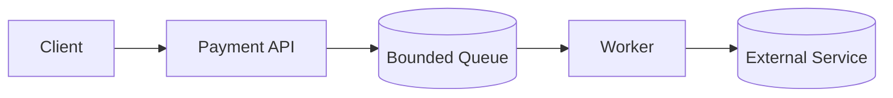

← [Back to Executive Summary](executive-summary.md)

## File: backpressure.md  

### Problem (Payments Context)  
In payment processing pipelines, if a downstream component (e.g. a reconciliation service or external API) is slower than the producer, queues build up until memory/CPU are exhausted. Without backpressure, surges (e.g., Black Friday spikes) can crash services.  

### Progressive Solution Path  
1. **Naïve (Unbounded Queue):** A REST endpoint inserts all incoming payments into an unbounded in-memory queue for processing. Under load, this queue grows until OOM.  
2. **Bounded Queue with Blocking:** Change to a `BlockingQueue` of fixed size (e.g. 1000). Producers block or wait when queue is full.  
3. **Rate Limiting:** Limit incoming rate per key or globally (e.g. using token bucket). Spring Cloud Gateway or a `Filter` can implement a simple limiter.  
4. **Load Shedding:** When at capacity, immediately return 429 Too Many Requests for excess requests.  
5. **Backoff & Circuit Breaker:** If downstream signals overload (e.g. via 429), clients back off and retry later. Use Hystrix or Resilience4j circuit breakers around slow calls.  
6. **Production Pattern:** Reactive Streams (e.g. Project Reactor) support backpressure natively. Most payment streams (Kafka) have built-in flow control.  

*Figure: Bounded queue between API and workers ensures at most N unprocessed tasks.*  

### Lab Steps (Backpressure)  

**Prerequisites:** Docker, Java, Redis or RabbitMQ (optional).  

1. **Naïve Queue:** PaymentService with an unbounded `LinkedList` queue. Worker threads consume slowly (simulate 20ms per task).  
   - **Test:** k6 flood of POST /payment (1000 RPS).  
   - **Expect:** Memory grows unbounded; eventually the JVM throws OOME.  

2. **Bounded BlockingQueue:** Change queue to `new ArrayBlockingQueue<>(100)`. Producers block when full.  
   - **Test:** Same flood.  
   - **Expect:** Throughput caps (around 1000 RPS no more than queue can handle). No crash, but clients hang if thread pool fills (timeout risk).  

3. **Rate Limiting/Shedding:** Introduce a filter (e.g. Bucket4j) to allow 100 RPS. Excess requests immediately get HTTP 429.  
   - **Expect:** Throughput ~100 RPS; excess requests dropped. System stable (no OOM). Clients must handle 429.  

4. **Circuit Breaker on Downstream:** Simulate a slow external service (add 100ms delay). Wrap calls in Resilience4j CB with threshold.  
   - **Expect:** Under sustained slow responses, CB opens and immediately fails fast. Reduces load on external.  

**Observability:**  
- Track queue length (`gauge.queue_depth`) and rejected count (`counter.http_429`).  
- Grafana: plot incoming vs processed rates.  

**Verification:**  
- Ensure system stays under memory limit.  
- Confirm `429` count rises when overloaded.  

**Checklist:**  
- [ ] Run without limits; observe crash.  
- [ ] Add bounded queue; confirm producer blocks.  
- [ ] Add rate limit; confirm 429s and stabilized throughput.  
- [ ] Simulate slow downstream; verify circuit breaker opens and protects the system.  

**Sources:** Backpressure concepts are fundamental in reactive design【55†L104-L112】. Netflix pioneered circuit breakers and bulkheads to isolate failures.  

---
