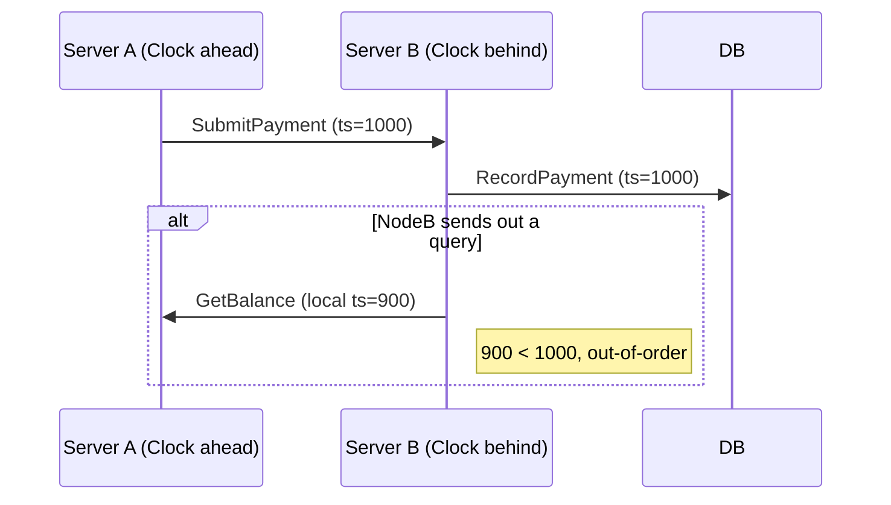

← [Back to Executive Summary](executive-summary.md)

## File: clock-skew.md  

### Problem (Payments Context)  
In distributed payment systems (across data centers), unsynchronized clocks can break ordering and consistency. For instance, timestamped transactions may appear out of order, causing reconciliation issues. Metrics: observed clock offset (>ms), anomaly rates (e.g. read-your-write violations).  

### Progressive Solution Path  
1. **Naïve (No Sync):** Rely on local `System.currentTimeMillis()` in each service. Under simulated skew, events will be inconsistent.  
2. **NTP Synchronization:** Ensure each server uses NTP/chrony to sync time. Docker containers can run `ntpdate`.  
3. **Hybrid Logical Clocks (HLC):** Incorporate an HLC library in code to generate monotonic timestamps【42†L93-L100】. On each event, if local clock < last received HLC, increment counter.  
4. **Vector Clocks:** Maintain a vector timestamp per node, merging on communication. (Complex for labs, skip implementation.)  
5. **Production (TrueTime Concept):** For completeness, explain Google’s TrueTime using GPS clocks【26†L19-L27】, though not implementable here.  

*Figure: If Node B’s clock lags Node A’s, a later operation may get a lower timestamp, confusing ordering.*  

### Lab Steps (Clock Skew)  

**Prerequisites:** Docker, Java, `date` command.  

1. **Simulate Skew:** Run two `clock-service` containers with system times 100ms apart (`docker run ... date -s ...`). Each logs its current time on request. A client triggers requests to both.  
   - **Expect:** Noticeable timestamp offset.  

2. **Check Read-Your-Writes:** Use a shared datastore (Redis) for simplicity. Write a value on NodeA with its timestamp, immediately read from NodeB. If NodeB’s time is behind, the timestamp appears “in the past.”  
   - **Observations:** Show violation of monotonic timestamp ordering.  

3. **Apply HLC:** Use an open-source HLC library (or implement simple: on each request, set `now = max(prevLocalTime, remoteTime) + counter`). Replace usages of `System.currentTimeMillis()` with HLC timestamp.  
   - **Expect:** Even with skew, HLC ensures every new timestamp ≥ previous.  

4. **Compare:** Log timestamps from both nodes for sequential operations; verify order is consistent.  

**Observability:**  
- Log node clock vs HLC timestamp for each operation (e.g. `/time`).  
- Prometheus: track a metric of maximum observed clock offset.  

**Verification:**  
- Without HLC: see non-monotonic times.  
- With HLC: all timestamps non-decreasing.  

**Checklist:**  
- [ ] Confirm clock skew (NodeA ahead of NodeB).  
- [ ] Observe misordered timestamps.  
- [ ] Implement HLC; verify monotonic ordering.  

**Sources:** Spanner TrueTime bounds clock error【26†L19-L27】; CockroachDB and MongoDB use HLC【42†L93-L100】 to avoid strict sync.  

---
