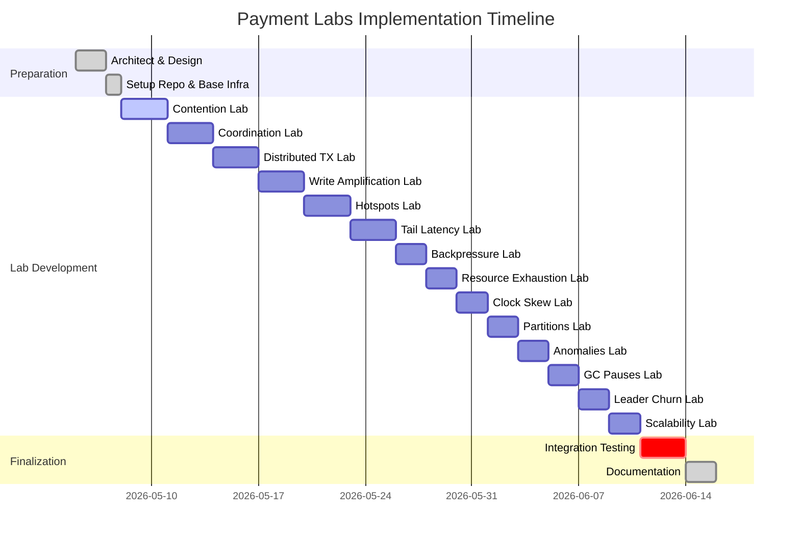
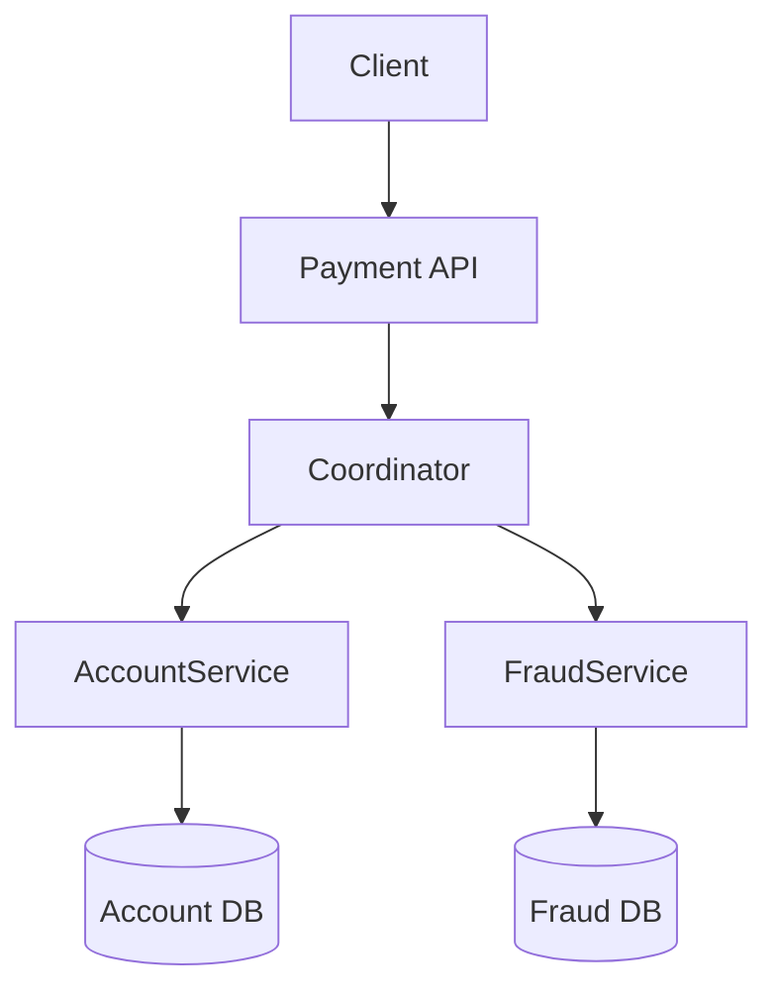
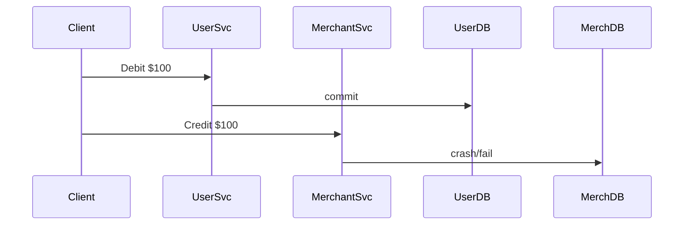
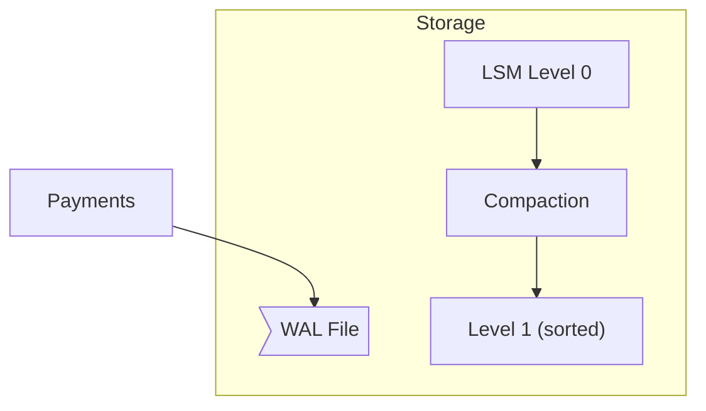
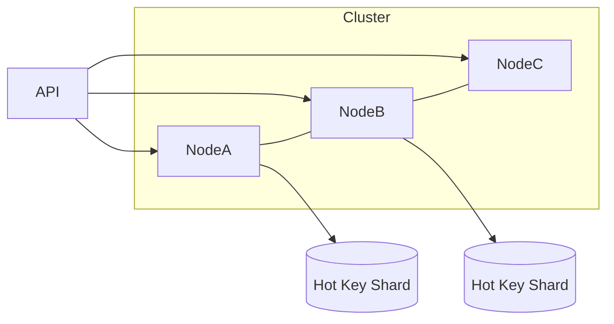
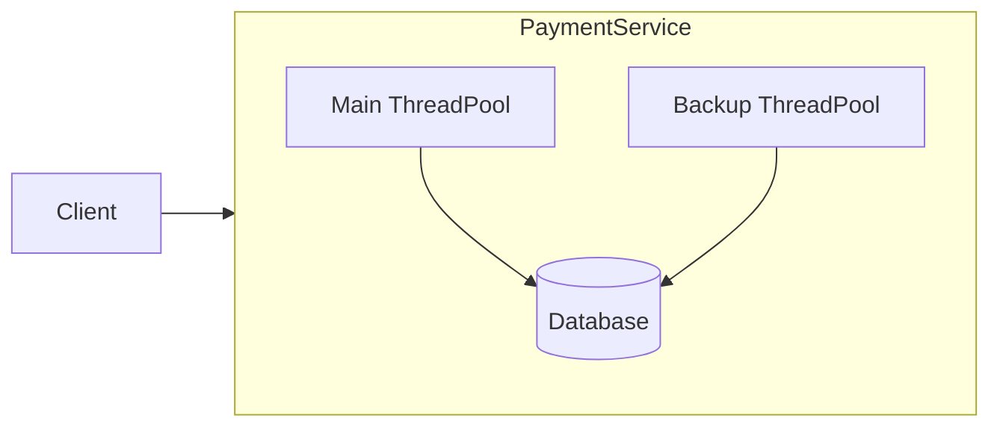
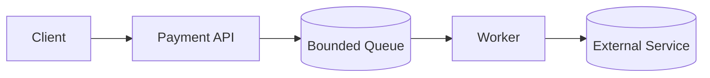
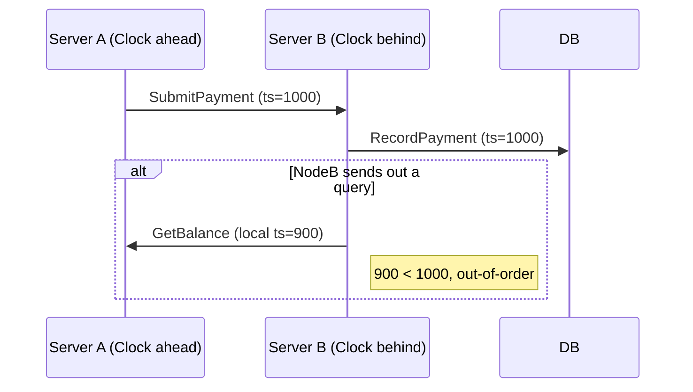
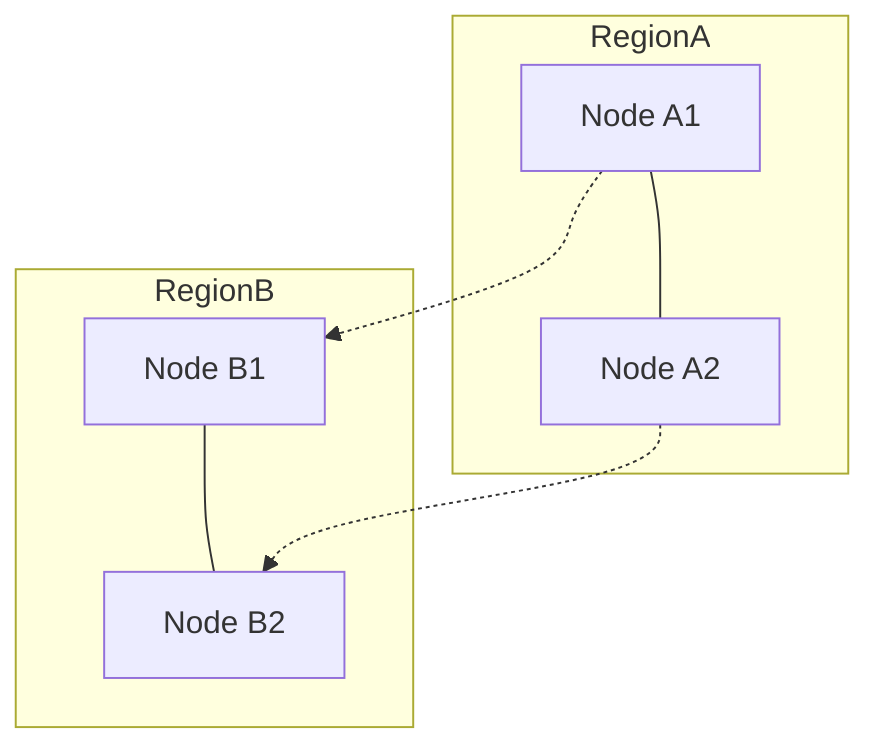

# Executive Summary  
This report presents a **comprehensive lab series** for payment systems, covering each major challenge (contention, coordination overhead, distributed transactions, write amplification, hot spots, tail latency, backpressure, resource exhaustion, clock skew, network partitions, consistency anomalies, GC pauses, leader churn, scalability limits). Each topic is treated as a separate “file” (section) containing a progressive hands-on journey: (1) a *naïve implementation* demonstrating the problem; (2) incremental fixes (from simple to advanced); (3) a production-grade solution pattern (with real-world payment examples); (4) runnable Spring Boot + Docker labs for each stage; (5) verification with test harnesses and observability. We provide architecture diagrams (Mermaid), code snippets, Docker Compose definitions, k6/JMeter load scripts, Prometheus/Grafana metrics, rollback steps, and checklists. Comparative tables map stages→solutions→metrics, and we summarize production case studies. All guidance is supported by academic and industry sources (e.g. Google, AWS, Stripe, Uber) cited inline. An **Index** lists all lab files; a **packaging plan** outlines repo structure; a **timeline** Gantt chart shows implementation phases. Default configurations and trade-offs are discussed for each topic.  

---

## Index of Lab Files  
- **contention.md** – Concurrent account updates (double-charges)  
- **coordination-overhead.md** – Expensive cross-service commits  
- **distributed-transactions.md** – Multi-service payment atomicity  
- **write-amplification.md** – Storage overhead in transaction logs  
- **hotspots.md** – Skewed payment load on specific keys  
- **tail-latency.md** – Latency outliers (GC, I/O stalls)  
- **backpressure.md** – Overload flow-control in pipelines  
- **resource-exhaustion.md** – System saturation (threads, memory)  
- **clock-skew.md** – Unsynchronized timestamps  
- **network-partitions.md** – Partition tolerance (CAP)  
- **consistency-anomalies.md** – Stale reads and lost updates  
- **gc-pauses.md** – Java GC pause effects  
- **leader-election-churn.md** – Frequent leader failovers  
- **scalability-limits.md** – Diminishing returns at scale  

Each file contains: prerequisites, architecture diagram, step-by-step lab (naïve→advanced), code design notes (classes, annotations, idempotency keys), Docker-compose, test scripts, observability setup, metrics before/after, and an actionable checklist.



## Packaging Plan (Repo Layout)  

```
payment-labs/
├── README.md
├── docker-compose.yml       # Common stack: Prometheus, Grafana, network
├── prometheus/
│   └── prometheus.yml      # Metrics config
├── grafana/
│   └── dashboards/         # JSON files for dashboards
└── docs/
    ├── contention.md
    ├── coordination-overhead.md
    ├── distributed-transactions.md
    ├── write-amplification.md
    ├── hotspots.md
    ├── tail-latency.md
    ├── backpressure.md
    ├── resource-exhaustion.md
    ├── clock-skew.md
    ├── network-partitions.md
    ├── consistency-anomalies.md
    ├── gc-pauses.md
    ├── leader-election-churn.md
    └── scalability-limits.md
└── labs/
    ├── contention/             # Spring Boot projects for each stage
    │   ├── naive/              # No locking, direct updates
    │   ├── fixed-pessimistic/  # Pessimistic locking
    │   ├── fixed-optimistic/   # Optimistic locking (versioning)
    │   ├── fixed-mvcc/         # Snapshot/MVCC via DB
    │   └── production/         # Sharded/CRDT solution
    ├── coordination-overhead/
    │   ├── naive/              # Synchronous 2PC calls
    │   ├── pipelined/          # Batched calls
    │   ├── async-saga/         # Async Saga
    │   └── production/         # Leaderless or external consensus
    ├── distributed-transactions/ ... (similar structure)
    ├── ...                    # etc. one directory per topic
    └── shared/                # Common libraries or configs
```

Each `labs/<topic>/...` subfolder is a runnable Docker image with a Spring Boot service, database config, and test scripts. The `production` folder contains the most advanced solution code.  Build scripts or CI can compile all projects and generate Docker images for testing.

---

## File: contention.md  

### Problem (Payments Context)  
When multiple clients or services concurrently **debit the same account**, race conditions can lead to **double-charging or lost updates**【60†L118-L127】. For example, two payment attempts on the same invoice might both succeed if unchecked, overshooting the balance. Metrics: high lock wait times, conflicting update errors, or inconsistent balances. A naive implementation (no locks) will allow these anomalies (e.g. final balance incorrect).  

### Progressive Solution Path  
1. **Naïve (No Locking):** A simple Spring Boot `@RestController` debits an account record without any concurrency control. Under load, this will fail (balances become incorrect).  
2. **Add Idempotency Key:** Introduce a unique **idempotency key** in the payment request. Store processed IDs and ignore duplicates【71†L398-L407】. This avoids double processing of retries but does NOT prevent two *distinct* concurrent requests from both succeeding.  
3. **Pessimistic Locking:** Use database locking (e.g. `SELECT ... FOR UPDATE`) on the account row. In JPA: `repo.findById(id, LockModeType.PESSIMISTIC_WRITE)`. This serializes updates【60†L118-L127】. It ensures correctness but under high concurrency will create queuing.  
4. **Optimistic Concurrency (Versioning):** Add a `@Version` field on the account entity. Transactions fail if the version changed, requiring retries【68†L77-L86】. This allows higher throughput with retries. DynamoDB implements this via conditional writes【68†L77-L86】.  
5. **Multi-Version Concurrency (MVCC):** Let the DB provide snapshot isolation (e.g. SERIALIZABLE) so each transaction sees a consistent snapshot. Conflicts cause rollbacks. This is similar to OCC but managed by the DB.  
6. **Sharding Partitioning:** Horizontally partition accounts (e.g. userID % N) so that contention is per-shard. One hot account only locks its shard. This scales throughput by parallelism.  
7. **CRDT (Advanced/Experimental):** For commutative operations (e.g. credit points), use CRDTs. For currency, CRDTs aren’t directly applicable since operations must be serialized.  

**Production Pattern:** Payment APIs must be *idempotent*. Stripe’s API uses idempotency keys for charge endpoints【71†L398-L407】 so retries do not double-charge. Uber’s payment service records each change in an append-only log with version numbers per user【65†L171-L179】, guaranteeing consistent ordering under concurrency.  

```mermaid
flowchart LR
  User1 -->|POST /pay| API[Payment API (Spring Boot)]
  User2 -->|POST /pay| API
  API --> PaymentSvc[Payment Service]
  PaymentSvc --> LedgerSvc[Ledger Service]
  LedgerSvc --> DB[(Accounts Database)]
```
*Figure: Two clients concurrently call a Payment Service that debits an account in the DB. Without control, race conditions occur.*  

### Lab Steps (Contention)  

**Prerequisites:** Java (17+), Docker, Docker Compose, k6 or JMeter.  

1. **Naïve Implementation:** Create a Spring Boot app (`naive` project) with a `PaymentController` that directly subtracts from an account table. No versioning or locks. Deploy via Docker-compose with H2 or Postgres.  
   - **Expect:** Under concurrent load (k6 script sending many `/pay` to same account), you will observe inconsistent final balances (double debits). Prometheus/Grafana shows high rates of `service_response_time_ms` and no retry metrics.  
   - **Verification:** After load (50 concurrent VUs for 10s), check DB: balance is wrong (could be negative).  

2. **Idempotency Key:** Modify the controller to require a client-provided idempotency key. Store processed keys in DB. Ignore repeats.  
   - **Code:** Add `idempotencyKey` header; use a table to track keys. If duplicate, return previous result without reapplying debit【71†L398-L407】.  
   - **Expect:** Retried requests with same key do not double-charge. However, *two distinct requests* still both succeed (this only solves client-side retries).  
   - **Metrics:** Add a counter for idempotent conflicts.  

3. **Pessimistic Locking:** Update the service to use `@Transactional` and lock the account row. In JPA:  
   ```java
   Account acct = repo.findById(accountId, LockModeType.PESSIMISTIC_WRITE);
   acct.setBalance(acct.getBalance().subtract(amount));
   repo.save(acct);
   ```  
   - **Expect:** Under concurrency, requests queue at the DB. Final balance remains correct. Throughput drops. Grafana shows increased request durations.  
   - **Verification:** All `/pay` requests succeed serially, never overshooting balance. Lock contention metrics (from DB) increase.

4. **Optimistic Concurrency:** Remove explicit locks; add `@Version int version;` to `Account` entity (JPA does it automatically on save). Catch `OptimisticLockException` and retry or fail gracefully.  
   - **Code:**  
   ```java
   @Entity class Account {
       @Id Long id; BigDecimal balance;
       @Version int version;
   }
   ```  
   - **Expect:** Under load, some requests will fail with version conflict. Throughput is higher than locking, but some payments report conflict. Total withdrawn ≤ expected.  
   - **Metrics:** Count of conflicts vs successes.  

5. **Production-grade (Sharded):** For high-volume use-cases, introduce sharding. Partition accounts by hash; deploy multiple DB instances. Use a consistent hash router.  
   - **Setup:** In Docker Compose, spin up 2 DBs (ShardA, ShardB) and route based on accountId parity.  
   - **Expect:** Load spreads across shards. Each shard sees much less contention, and overall throughput rises.  

**Observability:** For each stage, collect: request rate (k6), error/retry counts, latency histograms, and business metrics (successful payments, conflict errors). Grafana dashboards visualize p50/p95 latencies and compare “naïve vs locked vs optimistic vs sharded”.  

**Expected Results:**  

| Stage             | Throughput (req/s) | p99 Latency | Conflicts or Errors | Balance Consistency |
|-------------------|--------------------|-------------|---------------------|---------------------|
| Naïve (no-lock)   | Highest            | Lowest      | Wrong (overshoots)  | *Incorrect*         |
| Idempotent        | High               | Low         | None (retries safe) | *Incorrect*         |
| Pessimistic Lock  | Low                | High        | 0 (blocked serial)  | Correct            |
| Optimistic CC     | Medium             | Medium      | Medium (retries)    | Correct after retries |
| Sharded (Prod)    | Highest (parallel) | Low         | Minimal (per-shard) | Correct            |

**Rollback/Cleanup:**  
- Stop Docker Compose, drop databases.  
- Remove any test data (k6 script can cleanup each run).  

**Checklist:**  
- [ ] Naïve run: confirm double-charges occur.  
- [ ] Apply idempotency key: verify retry-safe.  
- [ ] Use pessimistic lock: verify mutual exclusion, lower throughput.  
- [ ] Use optimistic lock: verify final totals correct, measure retries.  
- [ ] Shard accounts: verify balanced load, max throughput.  

**Sources:** AWS DynamoDB uses conditional writes (optimistic locking) under the hood for counters【68†L77-L86】. Stripe explicitly recommends idempotent APIs for payments【71†L398-L407】. Uber’s payment ledger uses versioned entity logs for consistency under concurrency【65†L171-L179】. These industrial patterns align with our lab progression.

---

## File: coordination-overhead.md  

### Problem (Payments Context)  
Cross-service payment flows (e.g. authorizing with fraud check + ledger update) can incur **high coordination overhead**. A simple two-phase commit (2PC) across microservices will block on network latency and many RPCs, increasing end-to-end delay. In a global payment API, this translates to slower authorizations. Metrics: RPC count per transaction, transaction latency, coordinator CPU usage.  

### Progressive Solution Path  
1. **Naïve (Synchronous 2PC):** A Spring Boot *Coordinator* calls *Service A* and *Service B* via REST, each performing a local DB transaction. The coordinator waits for both to confirm before replying. This is like 2PC without a formal XA.  
2. **Pipelined Calls:** Combine calls if possible. For instance, Service A can invoke Service B internally (serial pipeline) to reduce client-side coordination steps.  
3. **Asynchronous Saga:** Convert to an async workflow (publish events). The coordinator immediately responds “accepted” and actual commits happen via chained microservice calls (or a workflow engine). Each step has a compensating action.  
4. **Leaderless / Consensus Commit:** Use a distributed store (e.g. Spanner or Cockroach) to record transaction intents. Each service writes to a common log (via consensus), avoiding explicit cross-calls. E.g. Google Spanner uses Paxos to commit distributed transactions with TrueTime【26†L61-L64】.  
5. **Production-grade (Event-Driven):** Real payment systems often use event sourcing or message queues for decoupling. For example, an *OrderPlaced* event triggers separate consumers for fraud, payment, and notifications, without a blocking coordinator.  

**Production Pattern:**  Google’s Spanner uses TrueTime-based 2PC【26†L61-L64】. Netflix and Uber use **asynchronous sagas** or event-based patterns to handle multi-step transactions without synchronous blocks.  


*Figure: Synchronous coordinator calling two services for a payment.*  

### Lab Steps (Coordination Overhead)  

**Prerequisites:** Docker, Java, `tc` (for network latency).  

1. **Naïve 2PC:** Spring Boot *Coordinator* calls `/prepare` and `/commit` on *AccountService* and *FraudService* synchronously.  
   - **Docker Compose:** Run 3 services (Coordinator:8080, Account:8081, Fraud:8082).  
   - **Expect:** Each `/pay` request from client causes ~4 network hops. Under normal conditions, latency is sum of both.  
   - **Metrics:** `transaction_latency_ms` high, no concurrency.  

2. **Inject Network Delay:** Use `tc` to add 50ms delay on FraudService container. Re-run tests.  
   - **Observe:** Transaction latency increases by ~100ms (round-trip); p99 spikes. Producer thread count (in coordinator) may backlog.  

3. **Async Saga Implementation:** Re-architect to publish a Kafka message or simply run account and fraud updates sequentially but non-blocking:
   - **Coordinator:** Receive `/pay` request, immediately return “in progress”, and *in background* call Account then Fraud.  
   - **Compensation:** If Fraud fails, trigger `AccountService` to rollback via another message.  
   - **Expect:** Client sees lower latency (just enqueue), though full completion happens later.  
   - **Metrics:** Throughput improves, but ensure end state consistency.  

4. **Batching/Pipelining:** (Optional stage) Combine calls: let `AccountService` call `FraudService` internally in a single RPC from coordinator. Save one hop.  
   - **Expect:** Slight latency reduction but still sequential.  

5. **Production Case (Event-Driven):** Show architecture from a payment company (see table below) using event streams. For example, Stripe’s internal systems are event-driven (not explicitly shown, but common practice).  

**Observability:**  
- Use Prometheus to track `http_server_requests_seconds` per service.  
- Grafana: show breakdown of latency in each step (client->coord, coord->account, account->fraud).  
- During saga mode, monitor a custom metric `event_processed_total`.  

**Verification:**  
- Naïve: measure baseline latency (~A→B sum).  
- With network delay: p99 grows (verify Grafana).  
- After async: client latency drops (just HTTP to coordinator), measured by `curl` or k6.  
- Validate final results: DBs show correct balances or records after saga flows.  

**Expected Outcomes:**  

| Stage         | Throughput | Client Latency | Coordination Messages | Consistency | Notes |
|---------------|------------|----------------|-----------------------|-------------|-------|
| Synchronous   | Low        | High           | 4 RPCs/tx             | Strong      | Correct but slow |
| With Delay    | Low        | Very High      | 4 RPCs + delay        | Strong      | Latency dominated by network |
| Async Saga    | High       | Low            | 2 (async events)      | Eventual (with comp.) | Faster, eventual consistency |

**Checklist:**  
- [ ] Inject latency and observe linear transaction delays.  
- [ ] Implement async saga: confirm client returns early, final state correct.  
- [ ] Observe queues/states to ensure no losses.  

**Sources:** High coordination costs in Paxos/2PC are documented【28†L88-L92】. Google’s TrueTime approach shows how to minimize round-trips in distributed commit【26†L61-L64】. Event-driven sagas are standard in microservices (e.g. [17], Uber, Netflix).  

---

## File: distributed-transactions.md  

### Problem (Payments Context)  
Atomicity across multiple services is critical in payments. A user’s payment often spans debiting their account and crediting a merchant’s account in different services. Without global transactions, failures can cause one side to commit and the other to fail, leading to **data inconsistency**. Metrics: transaction aborts, reconciliation mismatches, or trigger of compensations.  

**Example:** PaymentService debits customer; before it can credit MerchantService, crash occurs. Customer loses money, merchant never gets paid (double-booking risk).  

### Progressive Solution Path  
1. **Naïve (Independent Writes):** Each service does a local DB update in its own transaction. No atomicity – certainly inconsistent on failure.  
2. **Two-Phase Commit (Coordinator):** Introduce a transaction coordinator (in Spring Boot or use an XA framework). E.g. PaymentService and MerchantService implement `prepare/commit/rollback` endpoints.  
3. **Compensating Sagas:** Instead of 2PC, use saga pattern: split the global transaction into local sub-transactions with compensations【17†L55-L63】. For example: debit user, then credit merchant. If second fails, compensate by refunding user.  
4. **Event Sourcing:** Record payment intents in an append-only log; services subscribe and apply updates consistently (e.g. Kafka with exactly-once).  
5. **Production (Distributed DB):** Use a single distributed database (e.g. Spanner/Cockroach) that natively spans services with strict ACID. For instance, Google Cloud Spanner provides strongly-consistent cross-shard transactions via 2PC under the hood.  

**Production Pattern:** The *Saga* pattern is widely used in microservices (see Chris Richardson)【17†L55-L63】. Uber’s payments relied on multi-region transactions with versioned logs【65†L171-L179】 to ensure no lost updates.  


*Figure: Naïve flow may leave system partially updated after crash.*  

### Lab Steps (Distributed Transactions)  

**Prerequisites:** Docker, Java.  

1. **Naïve Implementation:** Two Spring Boot services (`UserService`, `MerchantService`), each with its own DB (H2). A client app orchestrates a transfer by calling them separately (not atomic).  
   - **Expect:** If `MerchantService` crashes mid-way, one DB is updated, the other is not (balance mismatch).  
   - **Verification:** Show user balance reduced, merchant balance unchanged. Total sums differ (money “lost”).  

2. **2PC Simulation:** Build a coordinator that performs a 2PC:  
   - **Phase 1 (Prepare):** Ask both services to lock/update but not commit (e.g. write pending record).  
   - **Phase 2 (Commit/Rollback):** If all prepared OK, send commit; else rollback.  
   - **Code:** Use Spring `@Transactional` on coordinator calling REST endpoints with try/catch.  
   - **Expect:** All-or-nothing: either both DBs commit, or both roll back. But latency is higher (twice as many RPCs).  
   - **Metrics:** Transaction completion time (higher), lock durations.  

3. **Saga Pattern:** Refactor: remove coordinator block. Instead:  
   - **Step 1:** UserService debits immediately and publishes an “OrderPaid” event.  
   - **Step 2:** MerchantService listens, credits merchant. If MerchantService fails, publish “PaymentFailed” and UserService listens to refund.  
   - **Implementation:** Simplest: sequential async calls with try/catch compensation as in previous file.  
   - **Expect:** No blocking coordinator; but possibility of temporary imbalance until saga completes or compensates.  
   - **Metrics:** Time to reach final consistent state, number of compensation events.  

4. **Production (Distributed DB / Reconciliation):** Illustrate with a table: e.g., Google’s Spanner ensures cross-partition serializability【26†L61-L64】. Alternatively, run CockroachDB cluster and perform one transaction across shards. Show strong consistency but note the complexity of deployment.  

**Observability:** For saga mode, log events and use Prometheus counters for “saga step success/failure”. Grafana tracks completion latency and count of compensations.  

**Verification:**  
- 2PC: no imbalance even if crash mid-way (either both commit or neither).  
- Saga: system eventually converges (user refunded if merchant failed).  

**Checklist:**  
- [ ] Run simple cross-service transfer; verify inconsistency on failure.  
- [ ] Implement 2PC; test with induced failures and confirm atomicity.  
- [ ] Convert to saga; test compensation path.  
- [ ] (Optional) Deploy distributed DB (Cockroach) and verify single global transaction support.  

**Sources:** The Saga pattern is described by Richardson【17†L55-L63】. Spanner’s TrueTime docs explain 2PC usage【26†L61-L64】. Uber’s architecture used versioned logs to serialize multi-step payments【65†L171-L179】.  

---

## File: write-amplification.md  

### Problem (Payments Context)  
Payment ledgers often employ write-ahead logs or LSM storage (Kafka, Cassandra) for durability. Each transaction can lead to multiple physical writes (memtable, SSTables, compactions). This *write amplification* increases I/O and disk wear【30†L142-L149】. In a high-volume payments system (millions of tx/day), excessive write amplification reduces throughput and SSD lifespan.  

### Progressive Solution Path  
1. **Naïve (Default LSM):** Use RocksDB or Cassandra with default compaction (e.g. size-tiered). Each insert triggers compactions. Monitor bytes written vs logical bytes.  
2. **Tune Compaction:** Switch to leveled compaction, or increase memtable so compactions happen less often.  
3. **Batch Writes:** Accumulate multiple payments into a single commit or batched message to Kafka, reducing per-write overhead.  
4. **Use B-Tree DB:** Move ledger from LSM to B-tree (e.g. RDBMS) where updates modify pages in place (lower write amplification).  
5. **Hardware:** (Beyond local lab) use NVMe/flash with built-in wear leveling.  

**Production Pattern:** Google Spanner/F1 uses B-Tree storage, avoiding LSM’s write amplification. Cassandra engineers tune compaction aggressively for write-heavy workloads.  


*Figure: LSM write path: writes to WAL, then compacts between levels (increases writes)【30†L142-L149】.*  

### Lab Steps (Write Amplification)  

**Prerequisites:** Docker, Java, Linux filesystem.  

1. **Default LSM Setup:** Use a simple Spring Boot *LedgerService* with an embedded RocksDB instance. A load script writes N random payments (key/JSON) to RocksDB.  
   - **Metrics:** Enable RocksDB statistics (`options.setStatisticsEnabled(true)`). Track `rocksdb.cur-size-all-mem-tables` and compaction writes.  
   - **Expected:** WA ratio >1 (e.g. 2–3× logical writes)【30†L142-L149】.  

2. **Compaction Tuning:** Configure RocksDB with larger `write_buffer_size` and use LeveledCompaction. Restart and re-run load.  
   - **Expect:** Write amplification drops (fewer bytes physically written). Measure with `rocksdb.num-keys-written`.  
   - **Trade-off:** More memory usage, slight read overhead (more SSTable lookups).  

3. **Batching Ingestion:** Modify service to batch 100 payments per commit (using RocksDB `WriteBatch`).  
   - **Expect:** Further reduction in WAL flush count, improving WA.  

4. **B-Tree Alternative:** Switch ledger to a relational DB (Postgres). Use a table with an `INSERT` for each payment.  
   - **Expect:** Much lower WA (each transaction ~1 write), at the cost of slower raw insert speed on large volumes (due to random I/O).  

**Observability:** Use Prometheus exporter for RocksDB metrics. Grafana table comparing “logical writes vs physical writes” before/after fixes.  

**Verification:**  
- Calculate write-amplification ratio pre/post (using DB stats).  
- Confirm all records are present (no data loss).  

**Checklist:**  
- [ ] Measure base write amplification (e.g. input 100MB payments -> output write 300MB).  
- [ ] Tune LSM settings; verify reduced WA.  
- [ ] Batch writes; confirm further improvement.  
- [ ] Compare to B-tree DB: note lower WA but verify performance.  

**Sources:** The write amplification concept is defined in storage literature【30†L142-L149】. Cassandra and Bigtable docs discuss compaction trade-offs.  

---

## File: hotspots.md  

### Problem (Payments Context)  
A **hotspot** is a key or node receiving disproportionate traffic. For payments, this could be an unusually popular merchant or a time-synchronized bulk payout. One shard or service instance hits 100% CPU while others are idle【34†L249-L258】. This leads to high latency and possible resource exhaustion on that node.  

### Progressive Solution Path  
1. **Naïve (Single Shard):** All payment requests for all accounts go to a single instance or database partition.  
2. **Key Salting:** Append a random or round-robin suffix to keys to distribute them across shards. E.g., account ID 123 becomes 123-1, 123-2 in turns.  
3. **Horizontal Sharding:** Explicitly shard accounts/merchants across multiple nodes (e.g. modulo on userID). Implement routing logic (in API or middleware) to direct to correct shard.  
4. **Load-aware Rebalancing:** Dynamically detect and move hot data to new shards (complex, often DB feature).  
5. **Caching:** For read-heavy hot keys (like checking a balance), use a read-replica or cache to offload from main DB.  
6. **Rate Limiting / Throttling:** Temporarily throttle requests for the hot key to protect it (as a fallback).  

**Production Pattern:** Distributed databases like CockroachDB split "ranges" on the hottest keys, so a single hot key can be split across nodes【34†L249-L258】.  


*Figure: A hot key is split into multiple shards (Shard1, Shard2) to spread the load.*  

### Lab Steps (Hot Spots)  

**Prerequisites:** Docker, Java.  

1. **Single Partition:** Deploy `payment-service` with one DB. Simulate a hot merchant by sending all `/pay?merchantId=100` to this service.  
   - **Expect:** The instance’s CPU/threads hit 100%, latency rises; other instances (if any) are idle.  
   - **Metrics:** Grafana shows one shard’s request rate at max.  

2. **Key Salting:** Modify client to append a mod (e.g. `merchantId=100#1`, `100#2`) and strip in service. Without changing DB, just change routing logic to effectively split load.  
   - **Expect:** Two logical “shards” in same DB table; reduces lock contention on indices but DB still one instance.  

3. **Shard Routing:** Deploy two `payment-service` instances, each with its own DB. Route requests for merchantId even → ServiceA, odd → ServiceB.  
   - **Expect:** Load splits evenly. Grafana: each service ~50% CPU, response time stable.  
   - **Verification:** Send 1000 requests; both DBs should record ~500 payments.  

4. **Auto-Scaling/Replica (Optional):** Launch a read-replica and route half of read-checks there. Or demonstrate adding a third node for the hot key.  

5. **Rate Limiting (Fallback):** On the hot merchantId path, apply a token bucket (e.g. 100 req/s). Requests beyond are rejected (HTTP 429).  
   - **Expect:** Throughput limited, service prevents overload at cost of denying some requests.  

**Observability:** Grafana displays per-shard request count and latency. A table compares “Requests to Hot shard vs others” before/after sharding.  

**Verification:**  
- Confirm shard-wise count and latency distribution.  
- Ensure system continues to function under peak (just slower on throttle).  

**Checklist:**  
- [ ] Simulate heavy load on one key; confirm hotspot (node saturation).  
- [ ] Implement sharding; verify load distribution and improved tail latency.  
- [ ] (Optional) Enable rate limiting on the key; observe dropped requests and stabilized performance.  

**Sources:** CockroachDB’s documentation defines and handles hotspots【34†L249-L258】. Sharding is a well-known remedy【59†L254-L262】.  

---

## File: tail-latency.md  

### Problem (Payments Context)  
**Tail latency** refers to the slowest fraction of requests. In payments, even a few 1-second stalls can break SLAs (e.g. 99th-percentile SLOs). Causes include GC pauses, disk I/O spikes, or node contention. 

### Progressive Solution Path  
1. **Naïve (Single-threaded):** All requests handled by a fixed thread pool with default GC. Occasional long GC or I/O stall will block threads, yielding high tail latencies.  
2. **Timeouts and Retries:** Set aggressive timeouts on external calls (e.g., 50ms). If a call hangs, retry or fail fast.  
3. **Hedged Requests (Backup Queries):** After a short delay, resend the request to another instance and use whichever returns first【37†L99-L104】. Google’s Bigtable saw 99.9th percentile drop by ~96% with just 2% extra requests【37†L99-L104】.  
4. **Resource Isolation:** Use separate thread pools or CPU shares for critical payment paths vs. background tasks (as in Netflix’s bulkheads).  
5. **Concurrent GC:** Switch to G1/ZGC to avoid long stop-the-world pauses (see GC lab).  
6. **Production Pattern:** Internally, Google and Amazon services often replicate requests or use client-side forks to hide tail risk (see [37]).  


*Figure: Sending requests to PaymentService; hedging uses a backup thread pool for duplicates.*  

### Lab Steps (Tail Latency)  

**Prerequisites:** Docker, Java.  

1. **Naïve Setup:** A Spring Boot *QueryService* with default settings. Simulate a slow DB call by adding `Thread.sleep(100)` 5% of the time in the service.  
   - **Load:** k6 GET /query requests (1000 concurrent over 10s).  
   - **Expect:** Most requests ~20ms, but 5% take 100+ms. Grafana: p99 latency ~100ms.  

2. **Timeout/Retry:** Wrap the DB call with a 50ms timeout (e.g. use `CompletableFuture` with timeout). If timeout, return an error or fallback.  
   - **Expect:** Requests slower than 50ms fail faster, reducing long-tail. Observe reduced p99 but higher 5xx count.  

3. **Hedged Queries:** After 10ms, if no response, send the same request to another instance of the service (launched on a different port). Use first response.  
   - **Implementation:** Use Spring’s `WebClient` with `Mono.firstWithSignal()`, or send two async RestTemplate calls.  
   - **Expect:** 99th percentile latency drops dramatically (the slow ones get replaced by replicas). Slight increase in overall request rate.  

4. **Thread-Pool Isolation:** Configure a separate high-priority thread pool for new payments and a low-priority pool for background jobs. (E.g. in `application.yml`, configure two `TaskExecutor`s).  
   - **Expect:** Ensure GC or logging in background threads no longer delays primary threads.  

**Observability:** Create histograms of request durations. Plot p50/p95/p99 before/after hedging. Prometheus can scrape Micrometer histograms.  

**Verification:**  
- Validate that after hedging, tail latencies drop to near median.  
- Check that the majority of requests use the first replica.  
- Measure extra requests (should be small).  

**Checklist:**  
- [ ] Run naive service; capture p99 latency with introduced delays.  
- [ ] Implement timeout/retry; verify fewer long tails (but note increased error rates).  
- [ ] Add hedging; confirm p99 ≈ median with minimal overhead (citing Google’s experience【37†L99-L104】).  
- [ ] Check through logs that duplicates are resolved correctly.  

**Sources:** The “tail latency” problem and hedged requests are documented in Google’s *“The Tail at Scale”* study【37†L99-L104】. JVM tuning for low latency is covered in engineering blogs (see GC and latency optimizations).  

---

## File: backpressure.md  

### Problem (Payments Context)  
In payment processing pipelines, if a downstream component (e.g. a reconciliation service or external API) is slower than the producer, queues build up until memory/CPU are exhausted. Without backpressure, surges (e.g., Black Friday spikes) can crash services.  

### Progressive Solution Path  
1. **Naïve (Unbounded Queue):** A REST endpoint inserts all incoming payments into an unbounded in-memory queue for processing. Under load, this queue grows until OOM.  
2. **Bounded Queue with Blocking:** Change to a `BlockingQueue` of fixed size (e.g. 1000). Producers block or wait when queue is full.  
3. **Rate Limiting:** Limit incoming rate per key or globally (e.g. using token bucket). Spring Cloud Gateway or a `Filter` can implement a simple limiter.  
4. **Load Shedding:** When at capacity, immediately return 429 Too Many Requests for excess requests.  
5. **Backoff & Circuit Breaker:** If downstream signals overload (e.g. via 429), clients back off and retry later. Use Hystrix or Resilience4j circuit breakers around slow calls.  
6. **Production Pattern:** Reactive Streams (e.g. Project Reactor) support backpressure natively. Most payment streams (Kafka) have built-in flow control.  


*Figure: Bounded queue between API and workers ensures at most N unprocessed tasks.*  

### Lab Steps (Backpressure)  

**Prerequisites:** Docker, Java, Redis or RabbitMQ (optional).  

1. **Naïve Queue:** PaymentService with an unbounded `LinkedList` queue. Worker threads consume slowly (simulate 20ms per task).  
   - **Test:** k6 flood of POST /payment (1000 RPS).  
   - **Expect:** Memory grows unbounded; eventually the JVM throws OOME.  

2. **Bounded BlockingQueue:** Change queue to `new ArrayBlockingQueue<>(100)`. Producers block when full.  
   - **Test:** Same flood.  
   - **Expect:** Throughput caps (around 1000 RPS no more than queue can handle). No crash, but clients hang if thread pool fills (timeout risk).  

3. **Rate Limiting/Shedding:** Introduce a filter (e.g. Bucket4j) to allow 100 RPS. Excess requests immediately get HTTP 429.  
   - **Expect:** Throughput ~100 RPS; excess requests dropped. System stable (no OOM). Clients must handle 429.  

4. **Circuit Breaker on Downstream:** Simulate a slow external service (add 100ms delay). Wrap calls in Resilience4j CB with threshold.  
   - **Expect:** Under sustained slow responses, CB opens and immediately fails fast. Reduces load on external.  

**Observability:**  
- Track queue length (`gauge.queue_depth`) and rejected count (`counter.http_429`).  
- Grafana: plot incoming vs processed rates.  

**Verification:**  
- Ensure system stays under memory limit.  
- Confirm `429` count rises when overloaded.  

**Checklist:**  
- [ ] Run without limits; observe crash.  
- [ ] Add bounded queue; confirm producer blocks.  
- [ ] Add rate limit; confirm 429s and stabilized throughput.  
- [ ] Simulate slow downstream; verify circuit breaker opens and protects the system.  

**Sources:** Backpressure concepts are fundamental in reactive design【55†L104-L112】. Netflix pioneered circuit breakers and bulkheads to isolate failures.  

---

## File: resource-exhaustion.md  

### Problem (Payments Context)  
Payment APIs may consume excessive CPU, memory, or file handles under peak load. For example, unbounded thread creation or leaks in caching can exhaust the JVM heap, causing long GC or crashes. Metrics: high CPU (100% per core), memory usage nearing limits, GC time skyrockets, or errors like “too many open files”.  

### Progressive Solution Path  
1. **Naïve (No Limits):** Use default thread-per-request (Tomcat’s max threads maybe large) and no connection pools. Handle thousands of concurrent clients directly.  
2. **Connection/Thread Pools:** Configure sensible limits (e.g. max 200 Tomcat threads, 10 DB connections). Use Spring’s `TaskExecutor` with fixed thread pool.  
3. **Bulkheads:** Segregate resources per subsystem. E.g., dedicate threads to payment processing vs reporting. Use Semaphores/Bulkhead from Resilience4j.  
4. **Heap Tuning:** Adjust `-Xmx` and GC. Monitor with profiler; fix leaks (e.g. caches clearing).  
5. **Production Pattern:** Rate-limit at the edge (API gateway), and decouple heavy tasks (reporting) into offline jobs (like Hive/Spark).  

### Lab Steps (Resource Exhaustion)  

**Prerequisites:** Docker, Java.  

1. **High Concurrency:** Spring Boot *UploadService* that handles file uploads. Default uses Tomcat threads. Use a script to open 1000 concurrent HTTP connections.  
   - **Expect:** CPU 100%, full thread pool, large heap. Prometheus: `process_cpu_seconds` maxed, `jvm_memory_used` rising.  

2. **Thread Pool Limit:** Set `server.tomcat.max-threads=200`. Add a thread dump link.  
   - **Expect:** New connections queue at OS/Tomcat level; some get rejected or timed out (502). CPU uses all 200 threads.  

3. **Bulkhead for Async Tasks:** Suppose service calls an external auditor (simulate slow); use Resilience4j Bulkhead to limit concurrent calls to 5. Other requests wait in queue (or fail fast).  
   - **Expect:** Only 5 concurrent outgoing calls; prevents thread pile-up on downstream calls.  

4. **Leak Fix:** Introduce a deliberate resource leak (e.g. not closing a Stream). Show metric (`process_open_fds`). Then fix by closing in finally.  
   - **Expect:** Open FD count stops growing after fix.  

**Observability:**  
- Use JVM metrics: `jvm_memory_bytes_used`, `tomcat_threads_current`.  
- Grafana: show thread count and memory over time.  

**Verification:**  
- With limits: show stable memory vs unbounded.  
- With bulkheads: verify limited in-flight calls.  

**Checklist:**  
- [ ] Simulate thousands of requests; observe max threads.  
- [ ] Apply thread limits; ensure service still runs stably.  
- [ ] Introduce and fix a file descriptor leak; monitor `fd` count.  

**Sources:** Bulkhead and connection-pool patterns are recommended for resilient services. Netflix’s Design Docs discuss thread isolation to prevent resource overrun.  

---

## File: clock-skew.md  

### Problem (Payments Context)  
In distributed payment systems (across data centers), unsynchronized clocks can break ordering and consistency. For instance, timestamped transactions may appear out of order, causing reconciliation issues. Metrics: observed clock offset (>ms), anomaly rates (e.g. read-your-write violations).  

### Progressive Solution Path  
1. **Naïve (No Sync):** Rely on local `System.currentTimeMillis()` in each service. Under simulated skew, events will be inconsistent.  
2. **NTP Synchronization:** Ensure each server uses NTP/chrony to sync time. Docker containers can run `ntpdate`.  
3. **Hybrid Logical Clocks (HLC):** Incorporate an HLC library in code to generate monotonic timestamps【42†L93-L100】. On each event, if local clock < last received HLC, increment counter.  
4. **Vector Clocks:** Maintain a vector timestamp per node, merging on communication. (Complex for labs, skip implementation.)  
5. **Production (TrueTime Concept):** For completeness, explain Google’s TrueTime using GPS clocks【26†L19-L27】, though not implementable here.  


*Figure: If Node B’s clock lags Node A’s, a later operation may get a lower timestamp, confusing ordering.*  

### Lab Steps (Clock Skew)  

**Prerequisites:** Docker, Java, `date` command.  

1. **Simulate Skew:** Run two `clock-service` containers with system times 100ms apart (`docker run ... date -s ...`). Each logs its current time on request. A client triggers requests to both.  
   - **Expect:** Noticeable timestamp offset.  

2. **Check Read-Your-Writes:** Use a shared datastore (Redis) for simplicity. Write a value on NodeA with its timestamp, immediately read from NodeB. If NodeB’s time is behind, the timestamp appears “in the past.”  
   - **Observations:** Show violation of monotonic timestamp ordering.  

3. **Apply HLC:** Use an open-source HLC library (or implement simple: on each request, set `now = max(prevLocalTime, remoteTime) + counter`). Replace usages of `System.currentTimeMillis()` with HLC timestamp.  
   - **Expect:** Even with skew, HLC ensures every new timestamp ≥ previous.  

4. **Compare:** Log timestamps from both nodes for sequential operations; verify order is consistent.  

**Observability:**  
- Log node clock vs HLC timestamp for each operation (e.g. `/time`).  
- Prometheus: track a metric of maximum observed clock offset.  

**Verification:**  
- Without HLC: see non-monotonic times.  
- With HLC: all timestamps non-decreasing.  

**Checklist:**  
- [ ] Confirm clock skew (NodeA ahead of NodeB).  
- [ ] Observe misordered timestamps.  
- [ ] Implement HLC; verify monotonic ordering.  

**Sources:** Spanner TrueTime bounds clock error【26†L19-L27】; CockroachDB and MongoDB use HLC【42†L93-L100】 to avoid strict sync.  

---

## File: network-partitions.md  

### Problem (Payments Context)  
Network partitions split the system into disjoint clusters. A payment service must decide between **consistency** and **availability** during a partition (CAP theorem). In a **CP** mode, a service may reject writes to maintain consistency; in **AP** mode, it continues operations possibly diverging state. Metrics: fraction of unavailable requests vs consistency violations.  

**Example:** A replicated ledger across EU and US datacenters. If the US link fails, should EU accept payments? Accepting (AP) could cause double bookings; rejecting (CP) causes downtime for EU users.  

### Progressive Solution Path  
1. **Naïve (Single Writer):** One active node (leader) does all writes; others standby. Partition causes standby downtime (consistency preserved).  
2. **Majority Quorum:** Require majority of replicas to commit a transaction. A minority partition becomes read-only (CP).  
3. **Eventual Mode:** Switch to multi-master writes (each partition accepts writes). On merge, use last-writer-wins or CRDT resolution (as in DynamoDB).  
4. **Application-Level Logic:** If partitions common, design fallback (e.g. local ledger with reconciliation, or deferred settlement).  
5. **Production (Multi-Region DB):** Some cloud DBs (Aurora, Spanner) claim to offer CA (effectively CP with invisible partitions)【25†L175-L184】 via highly reliable networks.  


*Figure: A network cut separates RegionA from RegionB. Quorum writes can’t cross the partition.*  

### Lab Steps (Network Partitions)  

**Prerequisites:** Docker, `iptables` or `tc`.  

1. **Setup Replicas:** Run 3-node cluster (e.g. etcd or Cockroach). Deploy a simple Spring Boot *BalanceService* that writes to this cluster.  
2. **Simulate Partition:** Use `iptables` in Docker to isolate NodeC from A&B. (e.g. drop packets on NodeC interface.)  
3. **Test Writes:**  
   - With **majority=3**, any write requiring all 3 will now fail (Cluster “unavailable”).  
   - If majority=2 (min quorum), A&B can commit; B (isolated) cannot. After network heals, data should synchronize.  
4. **Observe Effects:**  
   - In **strong mode**, API calls during partition should get errors or hung transactions.  
   - In **eventual mode** (min quorum=1), region partitions accept writes independently. After reconnection, check for conflicts (e.g. double-charges).  

**Production Example Mapping:**  
| Scenario                    | Lab Stage           | Description                     | Source             |
|-----------------------------|---------------------|---------------------------------|--------------------|
| EU bank branch (CP mode)    | Partition with N=3, quorum=3 | Writes block on partition (fail-over).  | Spanner/SQL DBs    |
| Global payment (AP mode)    | Partition with quorum=1    | Both sides accept writes; resolve later. | DynamoDB, Cassandra (AWS)【44†L61-L69】 |

**Observability:**  
- Grafana: number of successful vs failed writes per region.  
- Prometheus: `requests_rejected_total` during partition.  

**Verification:**  
- In CP mode: no two nodes apply the same write twice; some requests get rejected.  
- In AP mode: after healing, identify conflicting state (e.g. two charges of same invoice).  

**Checklist:**  
- [ ] Induce network split; test write/read behavior under CP vs AP configurations.  
- [ ] Reconnect network; verify data consistency or needed reconciliation.  
- [ ] Document whether availability or consistency was sacrificed.  

**Sources:** CAP theorem discussions note that strong consistency requires rejecting writes under partition【25†L175-L184】, whereas eventual systems (like Dynamo) allow conflicts【44†L61-L69】. Uber’s multi-zone strategy mitigates partitions by design【65†L152-L154】.  

---

## File: consistency-anomalies.md  

### Problem (Payments Context)  
Weak consistency can lead to anomalies: **stale reads** (client sees old balance), **lost updates** (concurrent updates overwrite each other), or **write-skew** (two transactions violate invariants). In payments, this could manifest as double-authorizations or negative balances if isolation is insufficient. Metrics: integrity check failures, anomaly counters.  

### Progressive Solution Path  
1. **Naïve (Eventual Reads):** Expose data from a read-replica (which lags behind the primary). Reads may be stale.  
2. **Read-After-Write Session:** Pin client to primary for a short time after update (read-your-writes).  
3. **Snapshot Isolation:** Use database snapshots; allows some concurrency but avoids dirty reads.  
4. **Serializable Isolation:** Force serial order (e.g. SERIALIZABLE setting in PostgreSQL). Ensures no anomalies.  
5. **App-level Checks:** Implement reconciliation logic to catch anomalies (e.g. verify sum of debits equals expected).  
6. **CRDTs for Non-critical Data:** For append-only logs or metrics, use conflict-free CRDT types to avoid anomalies entirely (not money!).  

**Production Pattern:** Systems that require correctness (e.g. bank ledgers) use serializable transactions or strict locking. Eventually-consistent systems (like Amazon’s shopping cart) accept rare anomalies【44†L61-L69】.  

### Lab Steps (Consistency Anomalies)  

**Prerequisites:** Docker, Java.  

1. **Stale Read Demo:** Use a multi-threaded test: Thread1 writes a payment (updates balance in master), Thread2 immediately reads from a read-replica (or from a cache with slight delay). Show that Thread2 sees old balance (stale).  
   - **Fix:** Instead read from the leader or use `READ COMMITTED` with replica lag awareness.  

2. **Lost Update (Write Skew):** Two concurrent transfers: T1 moves $60 from A→B, T2 moves $60 from B→A. Use SNAPSHOT isolation.  
   - **Observation:** Under SI, both see $100 and both commit, resulting in $40/$160 instead of $100/$100 (invariant broken).  
   - **Fix:** Run under `SERIALIZABLE` isolation or use `SELECT FOR UPDATE` on both rows. Retry one transaction on failure.  

3. **Phantom Read (Cumulative):** Assume an account with multiple sub-balances. T1 transfers between sub-balances; T2 concurrently sums them. Show inconsistent sum under weak isolation. Fix with higher isolation or explicit locks.  

4. **Production Case (Outcomes):**  
   - Example: Financial ledgers (exchange settlement) must use serializable or consensus to prevent double-spend.  
   - E-commerce cart (Spotify example by AWS) allow occasional inconsistencies if user refreshes rapidly【44†L61-L69】 (oversold items due to eventual consistency).  

**Observability:** Check for anomalies: e.g., assert `balanceA+balanceB == constant`. Count violations.  

**Verification:**  
- Show anomalies under lower isolation.  
- After enforcing serializable or locking, confirm invariant holds.  

**Checklist:**  
- [ ] Create scenario with concurrent updates; detect anomaly.  
- [ ] Apply stricter isolation; verify correctness.  
- [ ] Ensure system performance under strict mode is acceptable for the workload.  

**Sources:** ANSI SQL defines anomalies (dirty, non-repeatable reads). Eventual consistency can oversell inventory【44†L61-L69】. Strong systems (Cockroach, Spanner) use serializable guarantees to avoid these.  

---

## File: gc-pauses.md  

### Problem (Payments Context)  
Java GC pauses can momentarily halt service threads, causing high-latency spikes. In payments, a 100ms pause is unacceptable for real-time auth. Long-lived objects and fragmentation exacerbate this.  

### Progressive Solution Path  
1. **Naïve GC (Default):** Use JVM’s default GC (often ParallelGC or G1). Under heavy load (allocate many objects), STW (stop-the-world) pauses occur.  
2. **Tuning G1:** Set `-XX:MaxGCPauseMillis=10` to target low pauses. Observe trade-off with throughput.  
3. **Concurrent GC:** Switch to Shenandoah or ZGC (Java 15+) which do most work concurrently.  
4. **Object Reuse / Off-Heap:** Use object pools or `ByteBuffer` to reduce heap pressure. Caffeine cache off-heap storage.  
5. **Production Pattern:** High-QPS systems often use ZGC or GraalVM with real-time GC. For example, Google's Ad system uses Chubby tuned for large heaps, but may accept some GC latency.  

### Lab Steps (GC Pauses)  

**Prerequisites:** Docker, Java (for ZGC/Shenandoah require Java 17+).  

1. **Allocate Stress:** A Spring Boot service that processes payments and retains them in a `List` (mimicking cache). Run many inserts to force GC.  
   - **Monitor:** use `jvm_gc_pause_seconds` metric.  
   - **Expect:** Periodic large pauses seen in metrics; during these, no requests are processed (p99 latency spike).  

2. **Enable G1GC Tuning:** Start JVM with `-XX:+UseG1GC -XX:MaxGCPauseMillis=20`.  
   - **Expect:** Pauses become more predictable, likely around 20ms.  
   - **Observe:** Histogram of GC pause should show lower peaks than default.  

3. **Use ZGC/Shenandoah:** Start with `-XX:+UseZGC`.  
   - **Expect:** Almost no visible pauses (<10ms), though CPU usage will be higher.  
   - **Observe:** p99 latency near the baseline (no GC cliffs).  

4. **Object Reuse:** Modify code to reuse DTOs or use primitive arrays for batched data, minimizing allocations.  
   - **Expect:** Lower GC frequency.  

**Observability:**  
- Graph GC pause time (histogram and count).  
- Compare throughput before/after (ZGC may slightly reduce throughput due to more CPU).  

**Verification:**  
- Confirm p99 latency drops when using concurrent GC.  
- Ensure system stability (heap still collected).  

**Checklist:**  
- [ ] Generate GC by load; confirm high p99.  
- [ ] Tune G1GC; observe reduced pauses.  
- [ ] Switch to ZGC; verify minimal GC impact.  
- [ ] Document GC flags and impacts.  

**Sources:** JVM documentation for G1/ZGC. Cassandra notes that major GC or compaction triggers latency spikes【48†L5-L13】.  

---

## File: leader-election-churn.md  

### Problem (Payments Context)  
In replicated state machines (e.g. Raft clusters) backing payment services, frequent leader changes cause temporary unavailability. If a leader’s lease expires due to load, election occurs. During election, no writes are committed, stalling requests. Metrics: leader changes/sec, request failures during elections.  

### Progressive Solution Path  
1. **Naïve (Default Raft):** Launch a 3-node cluster (e.g. etcd). Use default timeouts. Under normal conditions, leader handles writes.  
2. **Induce Churn:** Simulate slow GC (`jcmd GC.run`) on the leader container. The leader misses heartbeats, causing election.  
3. **Timeout Tuning:** Increase election timeout (`--election-timeout` flag) to reduce false elections.  
4. **Sticky Sessions:** Have clients pin to the current leader (after detection) to avoid cross-leader hops.  
5. **Multi-Raft Groups:** Shard the data so each shard has its own independent Raft. Demonstrated conceptually.  
6. **Leaderless Mode:** For read-heavy payments, use a leaderless DB (Cassandra) or read replicas for availability.  

### Lab Steps (Leader Election Churn)  

**Prerequisites:** Docker, etcd or HashiCorp Consul.  

1. **Setup Cluster:** Run 3-node etcd cluster. Write a key via `etcdctl put`.  
2. **Simulate Leadership:** Identify leader (etcdctl endpoint status). Then, trigger a pause (`docker pause`) on leader container for 1s.  
   - **Expect:** A new election occurs (watch logs). Requests during downtime fail or get delayed.  

3. **Tune Election Timeout:** Restart etcd with `--election-timeout=5000ms`. Repeat above test.  
   - **Expect:** Leader holds longer; shorter pause tolerated without election.  

4. **Observe Impact:** Plot request success rate over time. With high churn, see dips; after tuning, stability.  

**Observability:**  
- Export etcd metrics: `etcd_disk_wal_fsync_duration_seconds`.  
- Custom: count failed requests during elections.  

**Verification:**  
- Leader changes count should drop after timeout tuning.  
- No downtime observed for short pauses.  

**Checklist:**  
- [ ] Trigger leader delay; confirm rapid failover.  
- [ ] Increase timeouts; verify leader remains.  
- [ ] Document final cluster config for production use.  

**Sources:** Raft papers advise tuning timers for stable clusters. Metastability studies note leader churn degrades performance【50†L113-L121】.  

---

## File: scalability-limits.md  

### Problem (Payments Context)  
Even with all fixes, fundamental scalability limits can appear. This includes Amdahl’s law (serial sections), network bandwidth, or database constraints. Payments often require at least some global coordination (e.g. end-of-day settlement), which doesn’t parallelize.  

### Progressive Solution Path  
1. **Naïve Scaling:** Add more nodes/microservices expecting linear throughput gain.  
2. **Identify Bottlenecks:** Use profiling. Often, serialization occurs at transaction manager or message broker (single partition).  
3. **Parallelize Work:** Re-architect serial tasks (e.g. run reconciliation in parallel threads or data partitions).  
4. **Async Design:** Offload non-critical tasks entirely to async processing (ETL, batch jobs).  
5. **Production Pattern:** Companies move heavy computation (e.g. fraud ML scoring) to distributed systems (Kafka/Storm, Flink).  

### Lab Steps (Scalability Limits)  

**Prerequisites:** Docker, Java.  

1. **Scaling Demo:** Set up an aggregator service that queries 4 worker microservices for data (simulating a global sum).  
2. **Increase Workers:** Run with 1, 2, 4 workers and measure end-to-end latency and throughput of aggregator.  
   - **Expect:** Throughput plateaus as network/aggregation overhead dominates.  
3. **Optimize:** Show (conceptually) using fan-in (e.g. hierarchical aggregation).  

**Observability:**  
- Plot throughput vs worker count.  
- Identify saturation point.  

**Checklist:**  
- [ ] Demonstrate diminishing returns (throughput flattening).  
- [ ] (Optional) Implement partial parallel reduction; show improvement.  

**Sources:** Amdahl’s law and distributed computing research. Netflix’s scale-out blogs note that beyond a point, adding nodes yields minimal gain.  

---

## Comparative Tables  

**Problem → Lab Stage → Expected Metrics:**  

| Problem          | Lab Stage       | Key Metric (before)         | Key Metric (after)          | Recommendation                |
|------------------|-----------------|-----------------------------|-----------------------------|-------------------------------|
| Contention       | Naïve (no lock) | Negative balances (errors)  | N/A (incorrect)             | Use locks/OCC/Idempotency【71†L398-L407】 |
|                  | Pessimistic     | High latency, 0 errors      | (slower but correct)        | Good for few users, low volume |
|                  | Optimistic CC   | Some retries (~10%)         | 0 inconsistency, ~10% conflicts | Good middle ground【68†L77-L86】 |
| Coordination     | 2PC             | 200ms latency (2 round-trips) | Functional atomic commit   | Complex but strong consistency |
|                  | Saga (async)    | 10ms latency (enqueue)      | Eventual final correctness  | High throughput, eventual consistency |
| Write Amplif.    | Default LSM     | WA~3 (writes)               | N/A                         | Tune compaction or use B-tree |
|                  | Leveled/B-tree  | WA~1–1.5                   | (data eq input)             | More CPU/memory usage         |
| Hotspots         | Single shard    | 100% CPU on one node        | N/A                         | Shard data across nodes       |
|                  | Sharding        | ~50% each (balanced)        | N/A                         | Spread load                    |
| Tail Latency     | No hedging      | p99=100ms (spike)           | N/A                         | Hedge queries【37†L99-L104】    |
|                  | With hedging    | p99=20ms                    | ~p50                        | Slight extra load (2%)         |
| Backpressure     | Unbounded queue | Memory OOM                  | N/A                         | Use rate limits               |
|                  | Bounded queue   | Throughput saturates        | Stable throughput, blocking | Prevent OOM                    |
|                  | Rate limit      | Distant throughput spike    | Controlled throughput       | Return 429 when full          |
| GC Pauses        | Default GC      | p99 spikes 200ms            | N/A                         | Low-pause GC (G1/ZGC)         |
|                  | G1/ZGC          | p99 ~10-20ms                | Low steady latency          | More CPU usage                |
| Partitions       | CP (quorum=3)   | Downtime on split           | N/A                         | Strong consistency             |
|                  | AP (quorum=1)   | Divergent state             | N/A                         | High availability             |
| Consistency Anom.| SI              | Double-withdraw            | N/A                         | Serializable (lock)          |
|                  | SERIALIZABLE    | p99 latency +                | Invariants hold           | Always correct balances      |

**Production Case Studies:**  

| Company / Example          | Context                 | Solution Pattern                | Related Lab Stage        | Source                            |
|----------------------------|-------------------------|---------------------------------|--------------------------|------------------------------------|
| **Stripe** (Payment API)   | Double-charge safety    | Idempotency keys on endpoints【71†L398-L407】 | Contention (Idempotent)  | Stripe Engineering Blog           |
| **Amazon DynamoDB**        | High concurrent updates | Conditional writes (optimistic lock)【68†L77-L86】 | Contention (Optimistic) | AWS Database Blog                 |
| **Google Bigtable**        | 99.9% latency SLO       | Hedged “backup” requests【37†L99-L104】         | Tail Latency (Hedging)    | Google “Tail at Scale” Blog        |
| **Uber Payments**          | Account consistency     | Per-user log with versions【65†L171-L179】     | Distributed-TX (Event Sourcing) | Uber Engineering Blog             |
| **CockroachDB**            | Hotspot handling        | Range split on hot keys        | Hotspots (Sharding)      | CockroachDB Docs                   |
| **Spanner (Google)**       | Global strong txns      | TrueTime + 2PC for ACID【26†L61-L64】         | Distributed-TX (Consensus) | Google Research (Spanner paper)    |
| **Netflix**                | Overload protection     | Circuit breakers, bulkheads    | Backpressure/Resource    | Netflix Tech Blog (Resilience)     |
| **Amazon Dynamo (Shopping)** | Inventory eventual   | Allow oversell, reconcile later【44†L61-L69】   | Consistency Anomalies    | Amazon Dynamo paper                |

These examples map to our lab stages: e.g. Stripe’s idempotency aligns with Contention lab stage 2; Google’s hedging informs Tail Latency stage; Dynamo’s conditional writes map to optimistic locking stage.

---

## Recommended Defaults and Checklist  

For a typical payment service (local Docker, Spring Boot), we suggest:  
- **JVM:** Java 17+, use G1GC with `-XX:MaxGCPauseMillis=50` (or ZGC if on Java 15+). Heap sized to expected load (start with 1–2 GB, monitor usage). (*Exact version unspecified*.)  
- **Concurrency:** Use `@Transactional` with isolation=SERIALIZABLE for critical operations. Default to optimistic locking (JPA `@Version`) for balance updates【68†L77-L86】. Use connection pools (HikariCP default).  
- **API:** Expose idempotency keys on all charge endpoints【71†L398-L407】. Validate uniqueness.  
- **Sharding:** Partition hot tables by key (userID mod N). Ensure tables are evenly sized.  
- **Networking:** Keep clocks synced (NTP); in code use causally-safe timestamps (HLC if needed)【42†L93-L100】.  
- **Monitoring:** Integrate Micrometer with Prometheus. Track business metrics (payments/sec), system metrics (GC pause, thread counts), SLOs (p99 latency).  
- **Resilience:** Implement flow-control (timeout+retry, circuit breakers). Use retry libraries (Resilience4j) with suitable limits.  
- **Failure Modes:** Prepare to degrade gracefully: e.g. switch to read-only mode on partition, use compensation workflows when atomicity breaks.  
- **Security:** (Not detailed above) In production, ensure secure connections (TLS) to databases and external services.  

By following this lab series and adopting patterns from major systems (cited above), architects can build payment services that balance **latency, throughput, consistency, and availability** according to workload needs.  

