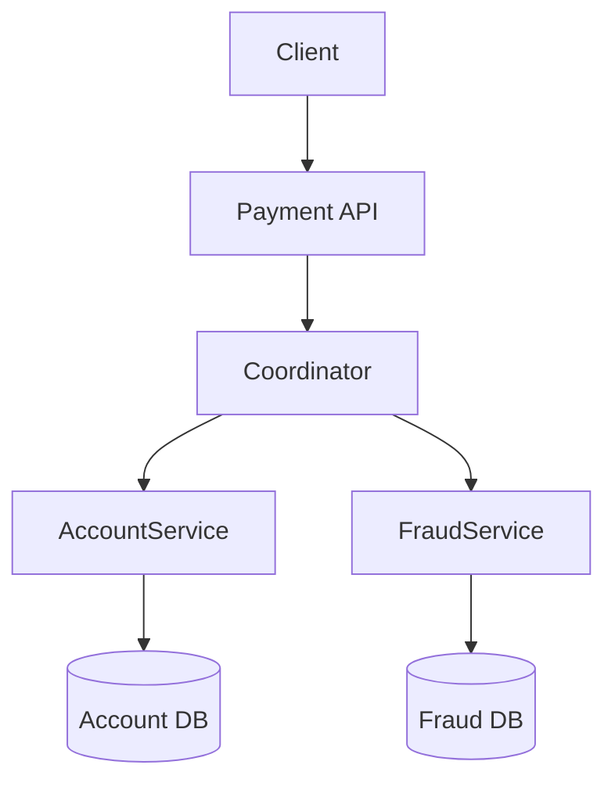

← [Back to Executive Summary](executive-summary.md)

## File: coordination-overhead.md  

### Problem (Payments Context)  
Cross-service payment flows (e.g. authorizing with fraud check + ledger update) can incur **high coordination overhead**. A simple two-phase commit (2PC) across microservices will block on network latency and many RPCs, increasing end-to-end delay. In a global payment API, this translates to slower authorizations. Metrics: RPC count per transaction, transaction latency, coordinator CPU usage.  

### Progressive Solution Path  
1. **Naïve (Synchronous 2PC):** A Spring Boot *Coordinator* calls *Service A* and *Service B* via REST, each performing a local DB transaction. The coordinator waits for both to confirm before replying. This is like 2PC without a formal XA.  
2. **Pipelined Calls:** Combine calls if possible. For instance, Service A can invoke Service B internally (serial pipeline) to reduce client-side coordination steps.  
3. **Asynchronous Saga:** Convert to an async workflow (publish events). The coordinator immediately responds “accepted” and actual commits happen via chained microservice calls (or a workflow engine). Each step has a compensating action.  
4. **Leaderless / Consensus Commit:** Use a distributed store (e.g. Spanner or Cockroach) to record transaction intents. Each service writes to a common log (via consensus), avoiding explicit cross-calls. E.g. Google Spanner uses Paxos to commit distributed transactions with TrueTime【26†L61-L64】.  
5. **Production-grade (Event-Driven):** Real payment systems often use event sourcing or message queues for decoupling. For example, an *OrderPlaced* event triggers separate consumers for fraud, payment, and notifications, without a blocking coordinator.  

**Production Pattern:**  Google’s Spanner uses TrueTime-based 2PC【26†L61-L64】. Netflix and Uber use **asynchronous sagas** or event-based patterns to handle multi-step transactions without synchronous blocks.  

*Figure: Synchronous coordinator calling two services for a payment.*  

### Lab Steps (Coordination Overhead)  

**Prerequisites:** Docker, Java, `tc` (for network latency).  

1. **Naïve 2PC:** Spring Boot *Coordinator* calls `/prepare` and `/commit` on *AccountService* and *FraudService* synchronously.  
   - **Docker Compose:** Run 3 services (Coordinator:8080, Account:8081, Fraud:8082).  
   - **Expect:** Each `/pay` request from client causes ~4 network hops. Under normal conditions, latency is sum of both.  
   - **Metrics:** `transaction_latency_ms` high, no concurrency.  

2. **Inject Network Delay:** Use `tc` to add 50ms delay on FraudService container. Re-run tests.  
   - **Observe:** Transaction latency increases by ~100ms (round-trip); p99 spikes. Producer thread count (in coordinator) may backlog.  

3. **Async Saga Implementation:** Re-architect to publish a Kafka message or simply run account and fraud updates sequentially but non-blocking:
   - **Coordinator:** Receive `/pay` request, immediately return “in progress”, and *in background* call Account then Fraud.  
   - **Compensation:** If Fraud fails, trigger `AccountService` to rollback via another message.  
   - **Expect:** Client sees lower latency (just enqueue), though full completion happens later.  
   - **Metrics:** Throughput improves, but ensure end state consistency.  

4. **Batching/Pipelining:** (Optional stage) Combine calls: let `AccountService` call `FraudService` internally in a single RPC from coordinator. Save one hop.  
   - **Expect:** Slight latency reduction but still sequential.  

5. **Production Case (Event-Driven):** Show architecture from a payment company (see table below) using event streams. For example, Stripe’s internal systems are event-driven (not explicitly shown, but common practice).  

**Observability:**  
- Use Prometheus to track `http_server_requests_seconds` per service.  
- Grafana: show breakdown of latency in each step (client->coord, coord->account, account->fraud).  
- During saga mode, monitor a custom metric `event_processed_total`.  

**Verification:**  
- Naïve: measure baseline latency (~A→B sum).  
- With network delay: p99 grows (verify Grafana).  
- After async: client latency drops (just HTTP to coordinator), measured by `curl` or k6.  
- Validate final results: DBs show correct balances or records after saga flows.  

**Expected Outcomes:**  

| Stage         | Throughput | Client Latency | Coordination Messages | Consistency | Notes |
|---------------|------------|----------------|-----------------------|-------------|-------|
| Synchronous   | Low        | High           | 4 RPCs/tx             | Strong      | Correct but slow |
| With Delay    | Low        | Very High      | 4 RPCs + delay        | Strong      | Latency dominated by network |
| Async Saga    | High       | Low            | 2 (async events)      | Eventual (with comp.) | Faster, eventual consistency |

**Checklist:**  
- [ ] Inject latency and observe linear transaction delays.  
- [ ] Implement async saga: confirm client returns early, final state correct.  
- [ ] Observe queues/states to ensure no losses.  

**Sources:** High coordination costs in Paxos/2PC are documented【28†L88-L92】. Google’s TrueTime approach shows how to minimize round-trips in distributed commit【26†L61-L64】. Event-driven sagas are standard in microservices (e.g. [17], Uber, Netflix).  

---
