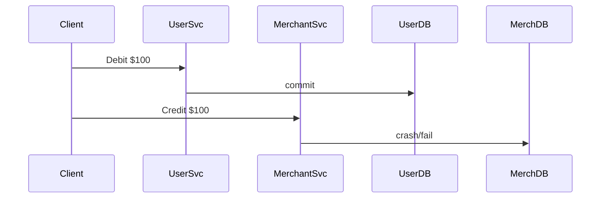

← [Back to Executive Summary](executive-summary.md)

## File: distributed-transactions.md  

### Problem (Payments Context)  
Atomicity across multiple services is critical in payments. A user’s payment often spans debiting their account and crediting a merchant’s account in different services. Without global transactions, failures can cause one side to commit and the other to fail, leading to **data inconsistency**. Metrics: transaction aborts, reconciliation mismatches, or trigger of compensations.  

**Example:** PaymentService debits customer; before it can credit MerchantService, crash occurs. Customer loses money, merchant never gets paid (double-booking risk).  

### Progressive Solution Path  
1. **Naïve (Independent Writes):** Each service does a local DB update in its own transaction. No atomicity – certainly inconsistent on failure.  
2. **Two-Phase Commit (Coordinator):** Introduce a transaction coordinator (in Spring Boot or use an XA framework). E.g. PaymentService and MerchantService implement `prepare/commit/rollback` endpoints.  
3. **Compensating Sagas:** Instead of 2PC, use saga pattern: split the global transaction into local sub-transactions with compensations【17†L55-L63】. For example: debit user, then credit merchant. If second fails, compensate by refunding user.  
4. **Event Sourcing:** Record payment intents in an append-only log; services subscribe and apply updates consistently (e.g. Kafka with exactly-once).  
5. **Production (Distributed DB):** Use a single distributed database (e.g. Spanner/Cockroach) that natively spans services with strict ACID. For instance, Google Cloud Spanner provides strongly-consistent cross-shard transactions via 2PC under the hood.  

**Production Pattern:** The *Saga* pattern is widely used in microservices (see Chris Richardson)【17†L55-L63】. Uber’s payments relied on multi-region transactions with versioned logs【65†L171-L179】 to ensure no lost updates.  

*Figure: Naïve flow may leave system partially updated after crash.*  

### Lab Steps (Distributed Transactions)  

**Prerequisites:** Docker, Java.  

1. **Naïve Implementation:** Two Spring Boot services (`UserService`, `MerchantService`), each with its own DB (H2). A client app orchestrates a transfer by calling them separately (not atomic).  
   - **Expect:** If `MerchantService` crashes mid-way, one DB is updated, the other is not (balance mismatch).  
   - **Verification:** Show user balance reduced, merchant balance unchanged. Total sums differ (money “lost”).  

2. **2PC Simulation:** Build a coordinator that performs a 2PC:  
   - **Phase 1 (Prepare):** Ask both services to lock/update but not commit (e.g. write pending record).  
   - **Phase 2 (Commit/Rollback):** If all prepared OK, send commit; else rollback.  
   - **Code:** Use Spring `@Transactional` on coordinator calling REST endpoints with try/catch.  
   - **Expect:** All-or-nothing: either both DBs commit, or both roll back. But latency is higher (twice as many RPCs).  
   - **Metrics:** Transaction completion time (higher), lock durations.  

3. **Saga Pattern:** Refactor: remove coordinator block. Instead:  
   - **Step 1:** UserService debits immediately and publishes an “OrderPaid” event.  
   - **Step 2:** MerchantService listens, credits merchant. If MerchantService fails, publish “PaymentFailed” and UserService listens to refund.  
   - **Implementation:** Simplest: sequential async calls with try/catch compensation as in previous file.  
   - **Expect:** No blocking coordinator; but possibility of temporary imbalance until saga completes or compensates.  
   - **Metrics:** Time to reach final consistent state, number of compensation events.  

4. **Production (Distributed DB / Reconciliation):** Illustrate with a table: e.g., Google’s Spanner ensures cross-partition serializability【26†L61-L64】. Alternatively, run CockroachDB cluster and perform one transaction across shards. Show strong consistency but note the complexity of deployment.  

**Observability:** For saga mode, log events and use Prometheus counters for “saga step success/failure”. Grafana tracks completion latency and count of compensations.  

**Verification:**  
- 2PC: no imbalance even if crash mid-way (either both commit or neither).  
- Saga: system eventually converges (user refunded if merchant failed).  

**Checklist:**  
- [ ] Run simple cross-service transfer; verify inconsistency on failure.  
- [ ] Implement 2PC; test with induced failures and confirm atomicity.  
- [ ] Convert to saga; test compensation path.  
- [ ] (Optional) Deploy distributed DB (Cockroach) and verify single global transaction support.  

**Sources:** The Saga pattern is described by Richardson【17†L55-L63】. Spanner’s TrueTime docs explain 2PC usage【26†L61-L64】. Uber’s architecture used versioned logs to serialize multi-step payments【65†L171-L179】.  

---
