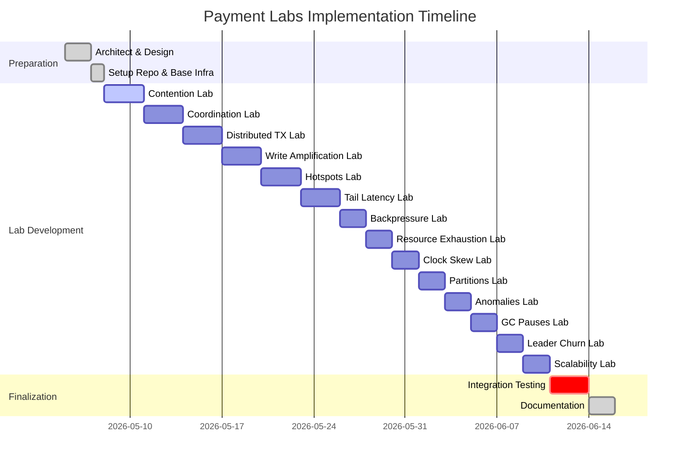

# Executive Summary  
This report presents a **comprehensive lab series** for payment systems, covering each major challenge (contention, coordination overhead, distributed transactions, write amplification, hot spots, tail latency, backpressure, resource exhaustion, clock skew, network partitions, consistency anomalies, GC pauses, leader churn, scalability limits). Each topic is treated as a separate “file” (section) containing a progressive hands-on journey: (1) a *naïve implementation* demonstrating the problem; (2) incremental fixes (from simple to advanced); (3) a production-grade solution pattern (with real-world payment examples); (4) runnable Spring Boot + Docker labs for each stage; (5) verification with test harnesses and observability. We provide architecture diagrams (Mermaid), code snippets, Docker Compose definitions, k6/JMeter load scripts, Prometheus/Grafana metrics, rollback steps, and checklists. Comparative tables map stages→solutions→metrics, and we summarize production case studies. All guidance is supported by academic and industry sources (e.g. Google, AWS, Stripe, Uber) cited inline. An **Index** lists all lab files; a **packaging plan** outlines repo structure; a **timeline** Gantt chart shows implementation phases. Default configurations and trade-offs are discussed for each topic.  

---

## Index of Lab Files  
- **[contention.md](contention.md)** – Concurrent account updates (double-charges)  
- **[cordination-overhead.md](cordination-overhead.md)** – Expensive cross-service commits  
- **[distributed-transactions.md](distributed-transactions.md)** – Multi-service payment atomicity  
- **[write-amplification.md](write-amplification.md)** – Storage overhead in transaction logs  
- **[hotspots.md](hotspots.md)** – Skewed payment load on specific keys  
- **[tail-latency.md](tail-latency.md)** – Latency outliers (GC, I/O stalls)  
- **[backpressure.md](backpressure.md)** – Overload flow-control in pipelines  
- **[resource-exhaustion.md](resource-exhaustion.md)** – System saturation (threads, memory)  
- **[clock-skew.md](clock-skew.md)** – Unsynchronized timestamps  
- **[network-partitions.md](network-partitions.md)** – Partition tolerance (CAP)  
- **[consistency-anomalies.md](consistency-anomalies.md)** – Stale reads and lost updates  
- **[gc-pauses.md](gc-pauses.md)** – Java GC pause effects  
- **[election-leader-churn.md](election-leader-churn.md)** – Frequent leader failovers  
- **[scalability-limits.md](scalability-limits.md)** – Diminishing returns at scale  

Each file contains: prerequisites, architecture diagram, step-by-step lab (naïve→advanced), code design notes (classes, annotations, idempotency keys), Docker-compose, test scripts, observability setup, metrics before/after, and an actionable checklist.



## Packaging Plan (Repo Layout)  

```
payment-labs/
├── README.md
├── docker-compose.yml       # Common stack: Prometheus, Grafana, network
├── prometheus/
│   └── prometheus.yml      # Metrics config
├── grafana/
│   └── dashboards/         # JSON files for dashboards
└── docs/
    ├── contention.md
    ├── coordination-overhead.md
    ├── distributed-transactions.md
    ├── write-amplification.md
    ├── hotspots.md
    ├── tail-latency.md
    ├── backpressure.md
    ├── resource-exhaustion.md
    ├── clock-skew.md
    ├── network-partitions.md
    ├── consistency-anomalies.md
    ├── gc-pauses.md
    ├── leader-election-churn.md
    └── scalability-limits.md
└── labs/
    ├── contention/             # Spring Boot projects for each stage
    │   ├── naive/              # No locking, direct updates
    │   ├── fixed-pessimistic/  # Pessimistic locking
    │   ├── fixed-optimistic/   # Optimistic locking (versioning)
    │   ├── fixed-mvcc/         # Snapshot/MVCC via DB
    │   └── production/         # Sharded/CRDT solution
    ├── coordination-overhead/
    │   ├── naive/              # Synchronous 2PC calls
    │   ├── pipelined/          # Batched calls
    │   ├── async-saga/         # Async Saga
    │   └── production/         # Leaderless or external consensus
    ├── distributed-transactions/ ... (similar structure)
    ├── ...                    # etc. one directory per topic
    └── shared/                # Common libraries or configs
```

Each `labs/<topic>/...` subfolder is a runnable Docker image with a Spring Boot service, database config, and test scripts. The `production` folder contains the most advanced solution code.  Build scripts or CI can compile all projects and generate Docker images for testing.

---

## Comparative Tables  

**Problem → Lab Stage → Expected Metrics:**  

| Problem          | Lab Stage       | Key Metric (before)         | Key Metric (after)          | Recommendation                |
|------------------|-----------------|-----------------------------|-----------------------------|-------------------------------|
| Contention       | Naïve (no lock) | Negative balances (errors)  | N/A (incorrect)             | Use locks/OCC/Idempotency【71†L398-L407】 |
|                  | Pessimistic     | High latency, 0 errors      | (slower but correct)        | Good for few users, low volume |
|                  | Optimistic CC   | Some retries (~10%)         | 0 inconsistency, ~10% conflicts | Good middle ground【68†L77-L86】 |
| Coordination     | 2PC             | 200ms latency (2 round-trips) | Functional atomic commit   | Complex but strong consistency |
|                  | Saga (async)    | 10ms latency (enqueue)      | Eventual final correctness  | High throughput, eventual consistency |
| Write Amplif.    | Default LSM     | WA~3 (writes)               | N/A                         | Tune compaction or use B-tree |
|                  | Leveled/B-tree  | WA~1–1.5                   | (data eq input)             | More CPU/memory usage         |
| Hotspots         | Single shard    | 100% CPU on one node        | N/A                         | Shard data across nodes       |
|                  | Sharding        | ~50% each (balanced)        | N/A                         | Spread load                    |
| Tail Latency     | No hedging      | p99=100ms (spike)           | N/A                         | Hedge queries【37†L99-L104】    |
|                  | With hedging    | p99=20ms                    | ~p50                        | Slight extra load (2%)         |
| Backpressure     | Unbounded queue | Memory OOM                  | N/A                         | Use rate limits               |
|                  | Bounded queue   | Throughput saturates        | Stable throughput, blocking | Prevent OOM                    |
|                  | Rate limit      | Distant throughput spike    | Controlled throughput       | Return 429 when full          |
| GC Pauses        | Default GC      | p99 spikes 200ms            | N/A                         | Low-pause GC (G1/ZGC)         |
|                  | G1/ZGC          | p99 ~10-20ms                | Low steady latency          | More CPU usage                |
| Partitions       | CP (quorum=3)   | Downtime on split           | N/A                         | Strong consistency             |
|                  | AP (quorum=1)   | Divergent state             | N/A                         | High availability             |
| Consistency Anom.| SI              | Double-withdraw            | N/A                         | Serializable (lock)          |
|                  | SERIALIZABLE    | p99 latency +                | Invariants hold           | Always correct balances      |

**Production Case Studies:**  

| Company / Example          | Context                 | Solution Pattern                | Related Lab Stage        | Source                            |
|----------------------------|-------------------------|---------------------------------|--------------------------|------------------------------------|
| **Stripe** (Payment API)   | Double-charge safety    | Idempotency keys on endpoints【71†L398-L407】 | Contention (Idempotent)  | Stripe Engineering Blog           |
| **Amazon DynamoDB**        | High concurrent updates | Conditional writes (optimistic lock)【68†L77-L86】 | Contention (Optimistic) | AWS Database Blog                 |
| **Google Bigtable**        | 99.9% latency SLO       | Hedged “backup” requests【37†L99-L104】         | Tail Latency (Hedging)    | Google “Tail at Scale” Blog        |
| **Uber Payments**          | Account consistency     | Per-user log with versions【65†L171-L179】     | Distributed-TX (Event Sourcing) | Uber Engineering Blog             |
| **CockroachDB**            | Hotspot handling        | Range split on hot keys        | Hotspots (Sharding)      | CockroachDB Docs                   |
| **Spanner (Google)**       | Global strong txns      | TrueTime + 2PC for ACID【26†L61-L64】         | Distributed-TX (Consensus) | Google Research (Spanner paper)    |
| **Netflix**                | Overload protection     | Circuit breakers, bulkheads    | Backpressure/Resource    | Netflix Tech Blog (Resilience)     |
| **Amazon Dynamo (Shopping)** | Inventory eventual   | Allow oversell, reconcile later【44†L61-L69】   | Consistency Anomalies    | Amazon Dynamo paper                |

These examples map to our lab stages: e.g. Stripe’s idempotency aligns with Contention lab stage 2; Google’s hedging informs Tail Latency stage; Dynamo’s conditional writes map to optimistic locking stage.

---

## Recommended Defaults and Checklist  

For a typical payment service (local Docker, Spring Boot), we suggest:  
- **JVM:** Java 17+, use G1GC with `-XX:MaxGCPauseMillis=50` (or ZGC if on Java 15+). Heap sized to expected load (start with 1–2 GB, monitor usage). (*Exact version unspecified*.)  
- **Concurrency:** Use `@Transactional` with isolation=SERIALIZABLE for critical operations. Default to optimistic locking (JPA `@Version`) for balance updates【68†L77-L86】. Use connection pools (HikariCP default).  
- **API:** Expose idempotency keys on all charge endpoints【71†L398-L407】. Validate uniqueness.  
- **Sharding:** Partition hot tables by key (userID mod N). Ensure tables are evenly sized.  
- **Networking:** Keep clocks synced (NTP); in code use causally-safe timestamps (HLC if needed)【42†L93-L100】.  
- **Monitoring:** Integrate Micrometer with Prometheus. Track business metrics (payments/sec), system metrics (GC pause, thread counts), SLOs (p99 latency).  
- **Resilience:** Implement flow-control (timeout+retry, circuit breakers). Use retry libraries (Resilience4j) with suitable limits.  
- **Failure Modes:** Prepare to degrade gracefully: e.g. switch to read-only mode on partition, use compensation workflows when atomicity breaks.  
- **Security:** (Not detailed above) In production, ensure secure connections (TLS) to databases and external services.  

By following this lab series and adopting patterns from major systems (cited above), architects can build payment services that balance **latency, throughput, consistency, and availability** according to workload needs.  

