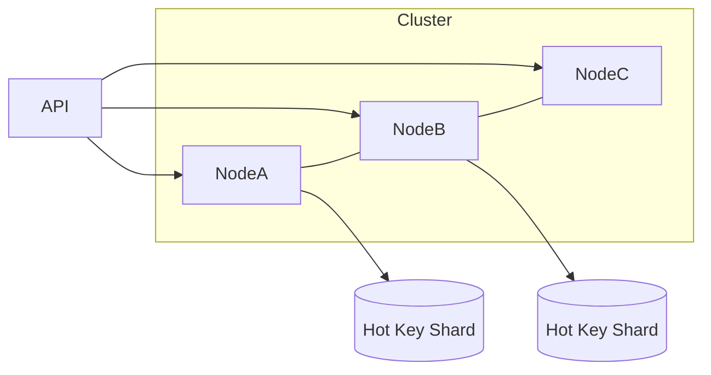

← [Back to Executive Summary](executive-summary.md)

## File: hotspots.md  

### Problem (Payments Context)  
A **hotspot** is a key or node receiving disproportionate traffic. For payments, this could be an unusually popular merchant or a time-synchronized bulk payout. One shard or service instance hits 100% CPU while others are idle【34†L249-L258】. This leads to high latency and possible resource exhaustion on that node.  

### Progressive Solution Path  
1. **Naïve (Single Shard):** All payment requests for all accounts go to a single instance or database partition.  
2. **Key Salting:** Append a random or round-robin suffix to keys to distribute them across shards. E.g., account ID 123 becomes 123-1, 123-2 in turns.  
3. **Horizontal Sharding:** Explicitly shard accounts/merchants across multiple nodes (e.g. modulo on userID). Implement routing logic (in API or middleware) to direct to correct shard.  
4. **Load-aware Rebalancing:** Dynamically detect and move hot data to new shards (complex, often DB feature).  
5. **Caching:** For read-heavy hot keys (like checking a balance), use a read-replica or cache to offload from main DB.  
6. **Rate Limiting / Throttling:** Temporarily throttle requests for the hot key to protect it (as a fallback).  

**Production Pattern:** Distributed databases like CockroachDB split "ranges" on the hottest keys, so a single hot key can be split across nodes【34†L249-L258】.  

*Figure: A hot key is split into multiple shards (Shard1, Shard2) to spread the load.*  

### Lab Steps (Hot Spots)  

**Prerequisites:** Docker, Java.  

1. **Single Partition:** Deploy `payment-service` with one DB. Simulate a hot merchant by sending all `/pay?merchantId=100` to this service.  
   - **Expect:** The instance’s CPU/threads hit 100%, latency rises; other instances (if any) are idle.  
   - **Metrics:** Grafana shows one shard’s request rate at max.  

2. **Key Salting:** Modify client to append a mod (e.g. `merchantId=100#1`, `100#2`) and strip in service. Without changing DB, just change routing logic to effectively split load.  
   - **Expect:** Two logical “shards” in same DB table; reduces lock contention on indices but DB still one instance.  

3. **Shard Routing:** Deploy two `payment-service` instances, each with its own DB. Route requests for merchantId even → ServiceA, odd → ServiceB.  
   - **Expect:** Load splits evenly. Grafana: each service ~50% CPU, response time stable.  
   - **Verification:** Send 1000 requests; both DBs should record ~500 payments.  

4. **Auto-Scaling/Replica (Optional):** Launch a read-replica and route half of read-checks there. Or demonstrate adding a third node for the hot key.  

5. **Rate Limiting (Fallback):** On the hot merchantId path, apply a token bucket (e.g. 100 req/s). Requests beyond are rejected (HTTP 429).  
   - **Expect:** Throughput limited, service prevents overload at cost of denying some requests.  

**Observability:** Grafana displays per-shard request count and latency. A table compares “Requests to Hot shard vs others” before/after sharding.  

**Verification:**  
- Confirm shard-wise count and latency distribution.  
- Ensure system continues to function under peak (just slower on throttle).  

**Checklist:**  
- [ ] Simulate heavy load on one key; confirm hotspot (node saturation).  
- [ ] Implement sharding; verify load distribution and improved tail latency.  
- [ ] (Optional) Enable rate limiting on the key; observe dropped requests and stabilized performance.  

**Sources:** CockroachDB’s documentation defines and handles hotspots【34†L249-L258】. Sharding is a well-known remedy【59†L254-L262】.  

---
