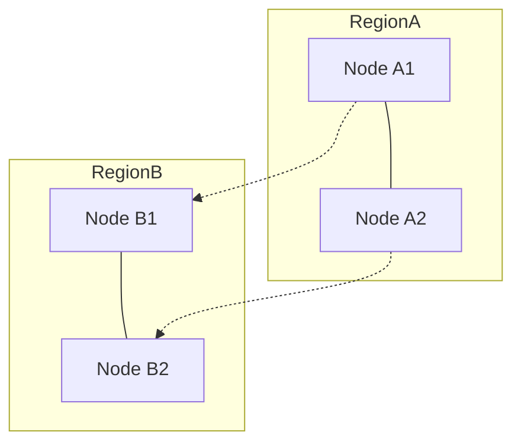

← [Back to Executive Summary](executive-summary.md)

## File: network-partitions.md  

### Problem (Payments Context)  
Network partitions split the system into disjoint clusters. A payment service must decide between **consistency** and **availability** during a partition (CAP theorem). In a **CP** mode, a service may reject writes to maintain consistency; in **AP** mode, it continues operations possibly diverging state. Metrics: fraction of unavailable requests vs consistency violations.  

**Example:** A replicated ledger across EU and US datacenters. If the US link fails, should EU accept payments? Accepting (AP) could cause double bookings; rejecting (CP) causes downtime for EU users.  

### Progressive Solution Path  
1. **Naïve (Single Writer):** One active node (leader) does all writes; others standby. Partition causes standby downtime (consistency preserved).  
2. **Majority Quorum:** Require majority of replicas to commit a transaction. A minority partition becomes read-only (CP).  
3. **Eventual Mode:** Switch to multi-master writes (each partition accepts writes). On merge, use last-writer-wins or CRDT resolution (as in DynamoDB).  
4. **Application-Level Logic:** If partitions common, design fallback (e.g. local ledger with reconciliation, or deferred settlement).  
5. **Production (Multi-Region DB):** Some cloud DBs (Aurora, Spanner) claim to offer CA (effectively CP with invisible partitions)【25†L175-L184】 via highly reliable networks.  

*Figure: A network cut separates RegionA from RegionB. Quorum writes can’t cross the partition.*  

### Lab Steps (Network Partitions)  

**Prerequisites:** Docker, `iptables` or `tc`.  

1. **Setup Replicas:** Run 3-node cluster (e.g. etcd or Cockroach). Deploy a simple Spring Boot *BalanceService* that writes to this cluster.  
2. **Simulate Partition:** Use `iptables` in Docker to isolate NodeC from A&B. (e.g. drop packets on NodeC interface.)  
3. **Test Writes:**  
   - With **majority=3**, any write requiring all 3 will now fail (Cluster “unavailable”).  
   - If majority=2 (min quorum), A&B can commit; B (isolated) cannot. After network heals, data should synchronize.  
4. **Observe Effects:**  
   - In **strong mode**, API calls during partition should get errors or hung transactions.  
   - In **eventual mode** (min quorum=1), region partitions accept writes independently. After reconnection, check for conflicts (e.g. double-charges).  

**Production Example Mapping:**  
| Scenario                    | Lab Stage           | Description                     | Source             |
|-----------------------------|---------------------|---------------------------------|--------------------|
| EU bank branch (CP mode)    | Partition with N=3, quorum=3 | Writes block on partition (fail-over).  | Spanner/SQL DBs    |
| Global payment (AP mode)    | Partition with quorum=1    | Both sides accept writes; resolve later. | DynamoDB, Cassandra (AWS)【44†L61-L69】 |

**Observability:**  
- Grafana: number of successful vs failed writes per region.  
- Prometheus: `requests_rejected_total` during partition.  

**Verification:**  
- In CP mode: no two nodes apply the same write twice; some requests get rejected.  
- In AP mode: after healing, identify conflicting state (e.g. two charges of same invoice).  

**Checklist:**  
- [ ] Induce network split; test write/read behavior under CP vs AP configurations.  
- [ ] Reconnect network; verify data consistency or needed reconciliation.  
- [ ] Document whether availability or consistency was sacrificed.  

**Sources:** CAP theorem discussions note that strong consistency requires rejecting writes under partition【25†L175-L184】, whereas eventual systems (like Dynamo) allow conflicts【44†L61-L69】. Uber’s multi-zone strategy mitigates partitions by design【65†L152-L154】.  

---
