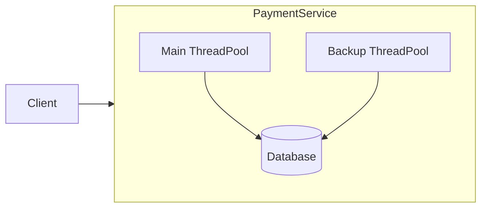

← [Back to Executive Summary](executive-summary.md)

## File: tail-latency.md  

### Problem (Payments Context)  
**Tail latency** refers to the slowest fraction of requests. In payments, even a few 1-second stalls can break SLAs (e.g. 99th-percentile SLOs). Causes include GC pauses, disk I/O spikes, or node contention. 

### Progressive Solution Path  
1. **Naïve (Single-threaded):** All requests handled by a fixed thread pool with default GC. Occasional long GC or I/O stall will block threads, yielding high tail latencies.  
2. **Timeouts and Retries:** Set aggressive timeouts on external calls (e.g., 50ms). If a call hangs, retry or fail fast.  
3. **Hedged Requests (Backup Queries):** After a short delay, resend the request to another instance and use whichever returns first【37†L99-L104】. Google’s Bigtable saw 99.9th percentile drop by ~96% with just 2% extra requests【37†L99-L104】.  
4. **Resource Isolation:** Use separate thread pools or CPU shares for critical payment paths vs. background tasks (as in Netflix’s bulkheads).  
5. **Concurrent GC:** Switch to G1/ZGC to avoid long stop-the-world pauses (see GC lab).  
6. **Production Pattern:** Internally, Google and Amazon services often replicate requests or use client-side forks to hide tail risk (see [37]).  

*Figure: Sending requests to PaymentService; hedging uses a backup thread pool for duplicates.*  

### Lab Steps (Tail Latency)  

**Prerequisites:** Docker, Java.  

1. **Naïve Setup:** A Spring Boot *QueryService* with default settings. Simulate a slow DB call by adding `Thread.sleep(100)` 5% of the time in the service.  
   - **Load:** k6 GET /query requests (1000 concurrent over 10s).  
   - **Expect:** Most requests ~20ms, but 5% take 100+ms. Grafana: p99 latency ~100ms.  

2. **Timeout/Retry:** Wrap the DB call with a 50ms timeout (e.g. use `CompletableFuture` with timeout). If timeout, return an error or fallback.  
   - **Expect:** Requests slower than 50ms fail faster, reducing long-tail. Observe reduced p99 but higher 5xx count.  

3. **Hedged Queries:** After 10ms, if no response, send the same request to another instance of the service (launched on a different port). Use first response.  
   - **Implementation:** Use Spring’s `WebClient` with `Mono.firstWithSignal()`, or send two async RestTemplate calls.  
   - **Expect:** 99th percentile latency drops dramatically (the slow ones get replaced by replicas). Slight increase in overall request rate.  

4. **Thread-Pool Isolation:** Configure a separate high-priority thread pool for new payments and a low-priority pool for background jobs. (E.g. in `application.yml`, configure two `TaskExecutor`s).  
   - **Expect:** Ensure GC or logging in background threads no longer delays primary threads.  

**Observability:** Create histograms of request durations. Plot p50/p95/p99 before/after hedging. Prometheus can scrape Micrometer histograms.  

**Verification:**  
- Validate that after hedging, tail latencies drop to near median.  
- Check that the majority of requests use the first replica.  
- Measure extra requests (should be small).  

**Checklist:**  
- [ ] Run naive service; capture p99 latency with introduced delays.  
- [ ] Implement timeout/retry; verify fewer long tails (but note increased error rates).  
- [ ] Add hedging; confirm p99 ≈ median with minimal overhead (citing Google’s experience【37†L99-L104】).  
- [ ] Check through logs that duplicates are resolved correctly.  

**Sources:** The “tail latency” problem and hedged requests are documented in Google’s *“The Tail at Scale”* study【37†L99-L104】. JVM tuning for low latency is covered in engineering blogs (see GC and latency optimizations).  

---
