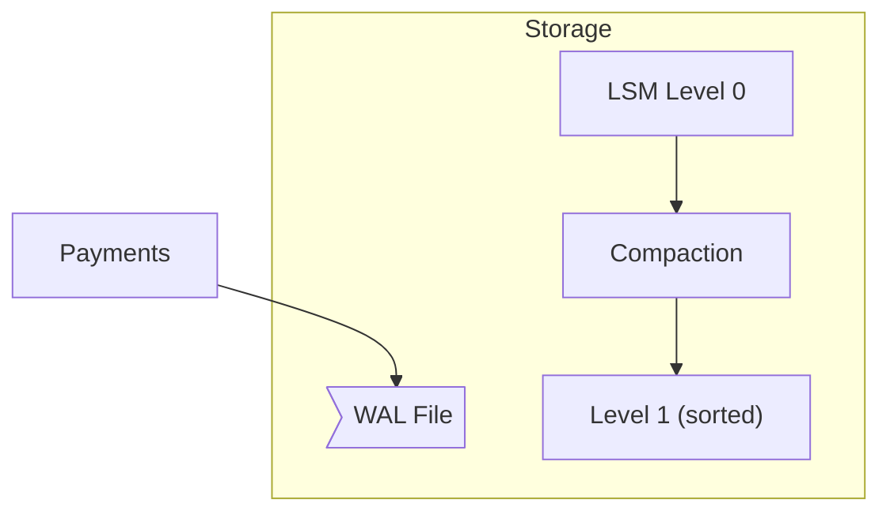

← [Back to Executive Summary](executive-summary.md)

## File: write-amplification.md  

### Problem (Payments Context)  
Payment ledgers often employ write-ahead logs or LSM storage (Kafka, Cassandra) for durability. Each transaction can lead to multiple physical writes (memtable, SSTables, compactions). This *write amplification* increases I/O and disk wear【30†L142-L149】. In a high-volume payments system (millions of tx/day), excessive write amplification reduces throughput and SSD lifespan.  

### Progressive Solution Path  
1. **Naïve (Default LSM):** Use RocksDB or Cassandra with default compaction (e.g. size-tiered). Each insert triggers compactions. Monitor bytes written vs logical bytes.  
2. **Tune Compaction:** Switch to leveled compaction, or increase memtable so compactions happen less often.  
3. **Batch Writes:** Accumulate multiple payments into a single commit or batched message to Kafka, reducing per-write overhead.  
4. **Use B-Tree DB:** Move ledger from LSM to B-tree (e.g. RDBMS) where updates modify pages in place (lower write amplification).  
5. **Hardware:** (Beyond local lab) use NVMe/flash with built-in wear leveling.  

**Production Pattern:** Google Spanner/F1 uses B-Tree storage, avoiding LSM’s write amplification. Cassandra engineers tune compaction aggressively for write-heavy workloads.  

*Figure: LSM write path: writes to WAL, then compacts between levels (increases writes)【30†L142-L149】.*  

### Lab Steps (Write Amplification)  

**Prerequisites:** Docker, Java, Linux filesystem.  

1. **Default LSM Setup:** Use a simple Spring Boot *LedgerService* with an embedded RocksDB instance. A load script writes N random payments (key/JSON) to RocksDB.  
   - **Metrics:** Enable RocksDB statistics (`options.setStatisticsEnabled(true)`). Track `rocksdb.cur-size-all-mem-tables` and compaction writes.  
   - **Expected:** WA ratio >1 (e.g. 2–3× logical writes)【30†L142-L149】.  

2. **Compaction Tuning:** Configure RocksDB with larger `write_buffer_size` and use LeveledCompaction. Restart and re-run load.  
   - **Expect:** Write amplification drops (fewer bytes physically written). Measure with `rocksdb.num-keys-written`.  
   - **Trade-off:** More memory usage, slight read overhead (more SSTable lookups).  

3. **Batching Ingestion:** Modify service to batch 100 payments per commit (using RocksDB `WriteBatch`).  
   - **Expect:** Further reduction in WAL flush count, improving WA.  

4. **B-Tree Alternative:** Switch ledger to a relational DB (Postgres). Use a table with an `INSERT` for each payment.  
   - **Expect:** Much lower WA (each transaction ~1 write), at the cost of slower raw insert speed on large volumes (due to random I/O).  

**Observability:** Use Prometheus exporter for RocksDB metrics. Grafana table comparing “logical writes vs physical writes” before/after fixes.  

**Verification:**  
- Calculate write-amplification ratio pre/post (using DB stats).  
- Confirm all records are present (no data loss).  

**Checklist:**  
- [ ] Measure base write amplification (e.g. input 100MB payments -> output write 300MB).  
- [ ] Tune LSM settings; verify reduced WA.  
- [ ] Batch writes; confirm further improvement.  
- [ ] Compare to B-tree DB: note lower WA but verify performance.  

**Sources:** The write amplification concept is defined in storage literature【30†L142-L149】. Cassandra and Bigtable docs discuss compaction trade-offs.  

---
